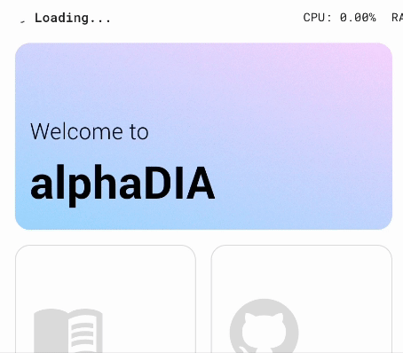

<!-- PROJECT LOGO -->
<br />
<div align="center">
  <a href="https://github.com/othneildrew/Best-README-Template">
    
  </a>

  <h3 align="center">alphaDIA</h3>

  <p align="center">
    <a href="https://www.biorxiv.org/content/10.1101/2024.05.28.596182v1">Preprint</a>
    ·
    <a href="https://github.com/Mannlabs/alphadia/releases/latest">Download</a>
    ·
    <a href="https://github.com/MannLabs/alphadia/discussions">Discussion</a>
    ·
    <a href="https://alphadia.readthedocs.io/en/latest/">Documentation</a>
  </p>
</div>


## Features
- Empirical library and fully predicted library search
- Label free quantification
- DIA multiplexing

We support the following vendor and processing modes:

| Platform              | Empirical lib | Predicted lib |
| :---------------- | :------: | :----: |
| Thermo .raw |   ✅   | ✅ |
| Sciex .wiff |   ✅   | ✅ |
| Bruker .d |  ✅   | ⚠️ |
> ⚠️ **Predicted libraries with Bruker .d data**<br>Alltough search is possible, alphaDIA's feature-free search takes a long time with fully predicted libraries. We are still evaluating how to better support fully predicted libraries.

## Manuscript
**Please cite:**
> **AlphaDIA enables End-to-End Transfer Learning for Feature-Free Proteomics**<br>
> Georg Wallmann, Patricia Skowronek, Vincenth Brennsteiner, Mikhail Lebedev, Marvin Thielert, Sophia Steigerwald, Mohamed Kotb, Tim Heymann, Xie-Xuan Zhou, Magnus Schwörer, Maximilian T. Strauss, Constantin Ammar, Sander Willems, Wen-Feng Zeng, Matthias Mann<br>
> [biorxiv.org](https://www.biorxiv.org/content/10.1101/2024.05.28.596182v1)

alphaDIA is part of the alphaX ecosystem:
- [alphaPept](https://github.com/MannLabs/alphapept)
- [alphaTims](https://github.com/MannLabs/alphatims)
- [alphaPeptDeep](https://github.com/MannLabs/alphapeptdeep)
- [alphaRaw](https://github.com/MannLabs/alpharaw)
- [alphaBase](https://github.com/MannLabs/alphabase)
- [directLFQ](https://github.com/MannLabs/directlfq)

## Installation

AlphaDIA can be installed on Windows, macOS and Linux. Please choose the preferred installation:

* [**One-click GUI installation:**](#one-click-gui-installation) Choose this installation if you only want the GUI and/or keep things as simple as possible.

* [**Pip installation**](#pip-installation)This version allows you to use alphaDIA in your python environment (provided e.g. by conda). You will only have access to the search engine backend and the command line but not the GUI.

* [**Developer installation:**](docs/installation.md#developer-installation) This installation allows to modify alphaDIA's source code directly. Generally, the developer version of alphaDIA outperforms the precompiled versions which makes this the installation of choice for high-throughput experiments.

* [**Docker installation:**](docs/installation.md#use-the-dockerized-version) Choose this for running alphaDIA in a Docker container, which is useful if you want to run it in a cloud environment.

* [**Slurm installation:**](docs/installation.md#slurm-cluster-installation) Choose this for running alphaDIA on a research cluster with Slurm.

### One-click GUI installation
Currently available for **MacOS** and **Windows**.
You can download the latest release of alphaDIA [here](https://github.com/Mannlabs/alphadia/releases/latest).

* **Windows:** Download the latest `win-x64` build. Save it and double click it to install. If you receive a warning during installation click *Run anyway*.
* **MacOS:** Download the latest `darwin-arm64` build. Please note that alphaDIA currently requires an ARM based M1/2/3 processor for the one-click installer. Save the installer and open the parent folder in Finder. Right-click and select *open*. If you receive a warning during installation click *Open*. If you want to use `.raw` files on Thermo instruments alphaRaw is required, which depends on Mono. A detailed guide to installing alphaRaw with mono can be found [here](https://github.com/MannLabs/alpharaw#installation).

As of now, **Linux** users need follow the steps for the
[developer installation](docs/installation.md#developer-installation) in order to use the GUI.

### Pip installation
If you want to use alphaDIA as a python library (e.g. for importing it into Jupyter notebooks) or only use the command-line interface,
you can install alphaDIA via `pip`.

#### 1. Prerequisites
Please make sure you have a valid installation of conda or miniconda.
We recommend setting up miniconda as described on their [website](https://docs.conda.io/projects/miniconda/en/latest/).

If you want to use `.raw` files on Thermo instruments alphaRaw is required, which depends on Mono. A detailed guide to installing alphaRaw with mono can be found [here](https://github.com/MannLabs/alpharaw#installation).

#### 2. Setting up the environment
For any Python package, it is highly recommended to use a separate, as otherwise dependancy conflicts can occur with already existing packages. We generally recommend [miniconda](https://docs.anaconda.com/free/miniconda/).

Finally, alphaDIA and all its dependencies can be installed by
```bash
pip install "alphadia[stable]"
```
We strongly recommend using the `stable` version, which has all dependencies fixed,
for reasons of reproducibility and integrity.

Alternatively, use
`pip install alphadia`, which comes with less version constraints. This is not recommended, but may be useful to avoid
version clashes if alphaDIA is imported as a library into a defined python requirement.
Note however, that this "loose" version might be affected e.g. by breaking changes of third-party dependencies.

Finally, run `alphadia -v` to check if the installation was successful;
`alphadia -h` will give you a list of command-line options.

---
## Getting started

This guide will show you how to perform your first search using the One-click GUI.
### 1. Prerequisites
Make sure you have installed the GUI using the one-click installer. To verify your installation, open alphaDIA and make sure that the `BundledExecutionEngine` is selected.



### 2. Test data

For the first search we will be using a spectral library to search 60SPD bulk HeLa samples on the Orbitrap Astral. Download the test samples and save them: [HeLa library](https://datashare.biochem.mpg.de/s/Uw2yfNSbApfPpTk), [RAW files].(https://datashare.biochem.mpg.de/s/339jg5HtGrwLwDN)

### 3. Search settings

#### Input Files
Import the library `.hdf` file and select the thre `.raw` files. You can select a human `.fasta` file for reannotation but it's generally not recommended for empirical spectral libraries.

#### Method Settings
Although alphaDIA is highly customizable, we will only specify a limited number of settings here. Go to the *Search* settings and make the following changes:
* Number of candidates: 5
* MS1 Tolerance 4ppm
* MS2 Tolerance 7ppm

#### Output files
Select an output folder where the search progress and the final results should be saved.

### 4. Run the search
Click *Run Workflow* to start the search and see the progress.


---
## Troubleshooting

In case of issues, check out the following:

* [Issues](https://github.com/MannLabs/alphadia/issues): Try a few different search terms to find out if a similar problem has been encountered before
* [Discussions](https://github.com/MannLabs/alphadia/discussions): Check if your problem or feature requests has been discussed before.

---
## Citations

A manuscript has been submitted to bioRxiv.

---
## How to contribute

If you like this software, you can give us a [star](https://github.com/MannLabs/alphadia/stargazers) to boost our visibility! All direct contributions are also welcome. Feel free to post a new [issue](https://github.com/MannLabs/alphadia/issues) or clone the repository and create a [pull request](https://github.com/MannLabs/alphadia/pulls) with a new branch. For an even more interactive participation, check out the [discussions](https://github.com/MannLabs/alphadia/discussions) and the [the Contributors License Agreement](misc/CLA.md).

Further information on the development process can be found [here](docs/installation.md).

---
## Changelog

See the [HISTORY.md](HISTORY.md) for a full overview of the changes made in each version.

---
## About

An open-source Python package of the AlphaPept ecosystem from the [Mann Labs at the Max Planck Institute of Biochemistry](https://www.biochem.mpg.de/mann).

---
## License

AlphaDIA was developed by the [Mann Labs at the Max Planck Institute of Biochemistry](https://www.biochem.mpg.de/mann) and is freely available with an [Apache License](LICENSE.txt). External Python packages (available in the [requirements](requirements) folder) have their own licenses, which can be consulted on their respective websites.

---
