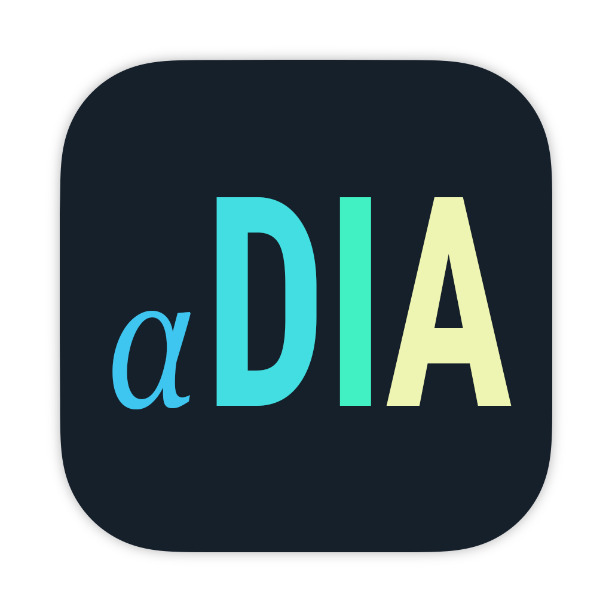

<!-- PROJECT LOGO -->
<br />
<div align="center">
  <a href="https://github.com/othneildrew/Best-README-Template">
    
  </a>

  <h3 align="center">alphaDIA</h3>

  <p align="center">
    <a href="https://github.com/MannLabs/alphadia">Preprint</a>
    ·
    <a href="https://github.com/Mannlabs/alphadia/releases/latest">Download</a>
    ·
    <a href="https://github.com/MannLabs/alphadia/discussions">Discussion</a>
    ·
    <a href="https://github.com/MannLabs/alphadia">Documentation</a>
  </p>
</div>


## Table of Contents</summary>
<ol>
  <li>
    <a href="#installation">Installation</a>
    <ul>
      <li><a href="#one-click-gui">One-click GUI</a></li>
      <li><a href="#developer">Developer install</a></li>
    </ul>
  </li>
  <li>
    <a href="#getting-started">Getting started</a>
  </li>
</ol>


## Installation

AlphaDIA can be installed on Windows, macOS and Linux. Please choose the preferred installation:

* [**One-click GUI install:**](#one-click-gui) Choose this installation if you only want the GUI and/or keep things as simple as possible. Currently available for **mac** and **windows**.

* [**Developer install:**](#developer) Choose this installation if you are familiar with CLI tools, Conda and Python. This installation allows access to all available features of AlphaDIA and even allows to modify its source code directly. Generally, the developer version of AlphaDIA outperforms the precompiled versions which makes this the installation of choice for high-throughput experiments.

### One-click GUI install

You can download the latest release of alphaDIA [here](https://github.com/Mannlabs/alphadia/releases/latest).

* **Windows** Download the latest `win-x64` build. Save it and double click it to install. If you receive a warning during installation click *Run anyway*.
* **MacOS** Download the latest `darwin-arm64` build. Please note that alphaDIA currently requires an arm based M1/2/3 processor for the One-click installer. Save the installer and open the parent folder in Finder. Right-click or two finger click and select *open*. If you receive a warning during installation click *Open*.

### Developer install

AlphaDIA can also be installed in editable (i.e. developer) mode with a few `bash` commands. This allows to fully customize the software and even modify the source code to your specific needs. When an editable Python package is installed, its source code is stored in a transparent location of your choice.

#### 1. Prerequisite
Please make sure you have a valid installation of conda or miniconda. We recommend setting up miniconda as described on their [website](https://docs.conda.io/projects/miniconda/en/latest/).

If you want to use or extend the GUI, please install NodeJS as described on their  [website](https://nodejs.org/en/download).

If you want to use `.raw` files on Thermo instruments alphaRaw is required, which depends on Mono. You can find the mono installation instructions [here](https://www.mono-project.com/download/stable/#download-lin). A detailed guide to installing alphaRaw can be found [here](https://github.com/MannLabs/alpharaw#installation).

#### 2. Setting up the environment

For any Python package, it is highly recommended to use a separate [conda virtual environment](https://docs.conda.io/en/latest/), as otherwise dependancy conflicts can occur with already existing packages.

```bash
conda create --name alpha python=3.9 -y
conda activate alpha
```

#### 3. Setting up the repository
***Depending on the state of the project the repository might not be public yet. In this case it is required that you generate a ssh key and link it to you GitHub account. [More](https://docs.github.com/en/authentication/connecting-to-github-with-ssh/adding-a-new-ssh-key-to-your-github-account)***

Navigate to a folder where you would like to install alphaDIA
```bash
cd ~/Documents/git
```

Next, download the alphaDIA repository from GitHub with a `git` command. This creates a new alphaDIA subfolder in your current directory.

```bash
git clone git@github.com:MannLabs/alphadia.git
```

Switch to development branch and pull the most recent version.
```bash
git switch development
git pull
```

#### 4. Installation

Finally, alphaDIA and all its dependencies need to be installed:
```bash
pip install ".[stable]"
```
This will install alphaDIA with fixed versions as defined in `requirements.txt`. Alternatively, use
`pip install -e ".[loose]"` to have less strict versioning. This is not recommended, but may be useful to avoid
version clashes if alphaDIA is imported as a library into a defined python requirement.
See below for a "developer" installation.

If you want to use the GUI you will need to install all frontend packages using npm.

```bash
cd alphadia/gui
npm install
```

The GUI can be started by typing
```bash
npm run dev
```

---
## Getting started

This guide will show you how to perform your first search using the One-click GUI.
### 1. Prerequisites
Make sure you have installed the GUI using the one-click installer. To verify your installation, open alphaDIA and make sure that the `BundledExecutionEngine` is selected.


### 2. Test data

For the first search we will be using a spectral library to search 60SPD bulk HeLa samples on the Orbitrap Astral. Download the test samples and save them: [HeLa library](https://datashare.biochem.mpg.de/s/Uw2yfNSbApfPpTk), [RAW files].(https://datashare.biochem.mpg.de/s/339jg5HtGrwLwDN)

### 3. Search settings

#### Input Files
Import the library `.hdf` file and select the thre `.raw` files. You can select a human `.fasta` file for reannotation but it's generally not recommended for empirical spectral libraries.

#### Method Settings
Although alphaDIA is highly customizable, we will only specify a limited number of settings here. Go to the *Search* settings and make the following changes:
* Number of candidates: 5
* MS1 Tolerance 4ppm
* MS2 Tolerance 7ppm

#### Output files
Select an output folder where the search progress and the final results should be saved.

### 4. Run the search
Click *Run Workflow* to start the search and see the progress.


---
## Troubleshooting

In case of issues, check out the following:

* [Issues](https://github.com/MannLabs/alphadia/issues): Try a few different search terms to find out if a similar problem has been encountered before
* [Discussions](https://github.com/MannLabs/alphadia/discussions): Check if your problem or feature requests has been discussed before.

---
## Citations

There are currently no plans to draft a manuscript.

---
## How to contribute

If you like this software, you can give us a [star](https://github.com/MannLabs/alphadia/stargazers) to boost our visibility! All direct contributions are also welcome. Feel free to post a new [issue](https://github.com/MannLabs/alphadia/issues) or clone the repository and create a [pull request](https://github.com/MannLabs/alphadia/pulls) with a new branch. For an even more interactive participation, check out the [discussions](https://github.com/MannLabs/alphadia/discussions) and the [the Contributors License Agreement](misc/CLA.md).

##### Developers' install
To take advantage of all features use the `-e` flag for a development install,
and add the `development` tag to install additional packages required for development only, e.g.
```bash
pip install -e ".[stable,development]"
```
***By using the editable flag `-e`, all modifications to the [alphaDIA source code folder](alphadia ) are directly reflected when running alphaDIA. Note that the alphaDIA folder cannot be moved and/or renamed if an editable version is installed.***

---
## Changelog

See the [HISTORY.md](HISTORY.md) for a full overview of the changes made in each version.
---
## About

An open-source Python package of the AlphaPept ecosystem from the [Mann Labs at the Max Planck Institute of Biochemistry](https://www.biochem.mpg.de/mann).

---
## License

AlphaDIA was developed by the [Mann Labs at the Max Planck Institute of Biochemistry](https://www.biochem.mpg.de/mann) and is freely available with an [Apache License](LICENSE.txt). External Python packages (available in the [requirements](requirements) folder) have their own licenses, which can be consulted on their respective websites.

---
