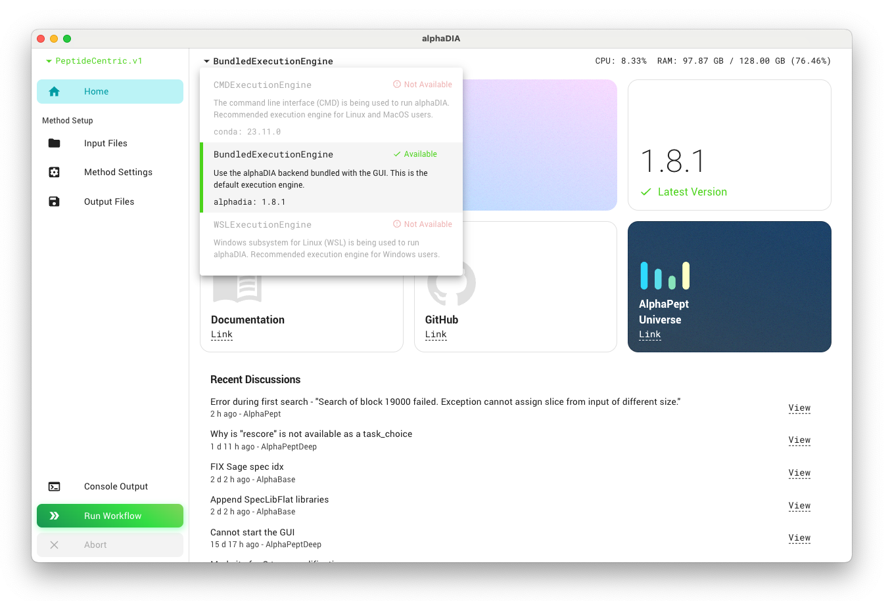
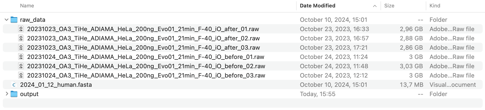
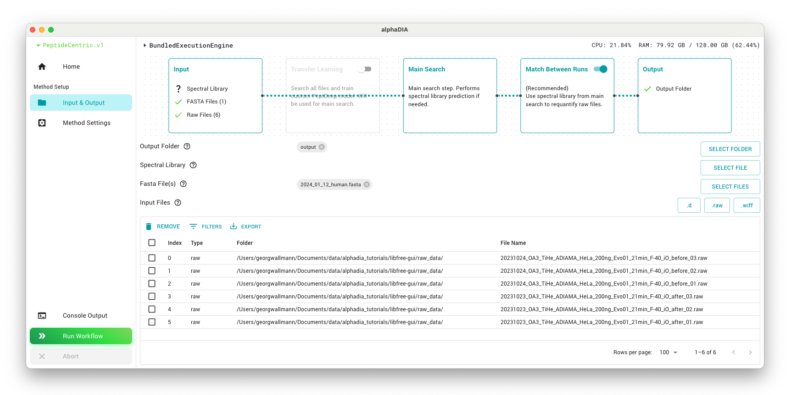
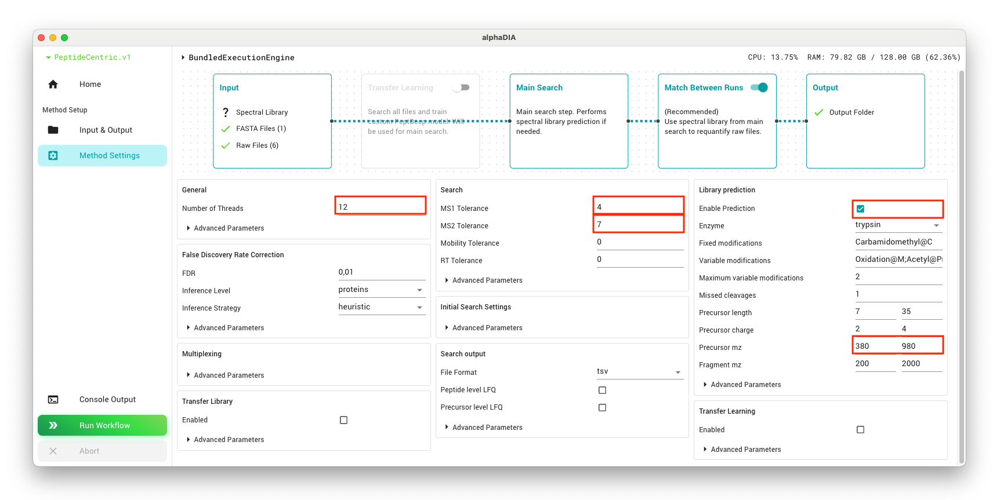
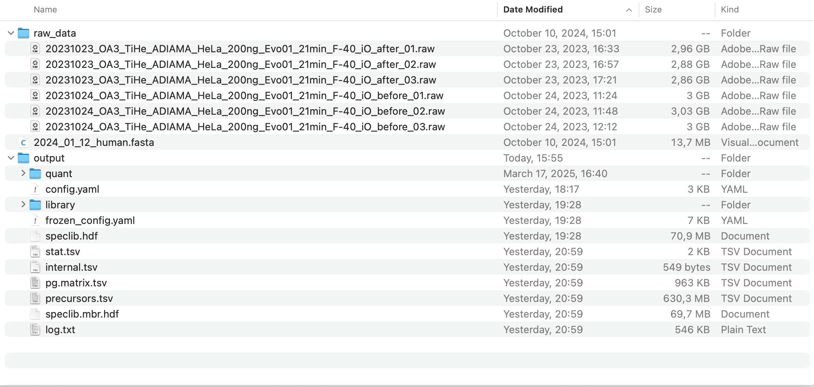

# Library-free DIA search using the GUI
**This tutorial was created using alphaDIA 1.10.1 - please be aware that there might be changes in your version**

## 1. Prerequisites
Make sure that you have a machine with at least 64 gigabytes of memory.
Please download the test data for this tutorial [here](https://datashare.biochem.mpg.de/s/jPu1DqsS4llyYNE). We will be using replicates of label-free bulk DIA data of HeLa digests acquired on the Orbitrap Astral.
Also make sure you have a valid alphaDIA installation including the GUI. The easiest option is the one-click installer, and a summary of all installation options can be found [here](<project:../installation.md>).
Also ensure the right execution engine has been selected and your version is up to date.

## 2. Project Structure
In this workflow, we will perform a DIA search that handles both library generation and cross-sample quantification (Match Between Runs) automatically. We will not use transfer learning in this workflow as we are looking for unmodified peptides from instruments well supported by the default PeptDeep model.

Start by preparing a single output folder for your analysis results.

## 3. Search Input and Output
To set up the search:

1. Select all raw files by clicking the `.raw` button and add them to the file list.
2. Add the FASTA file which will be used for library prediction by clicking the `SELECT FILE` button.

As we will be using a two-step search, make sure that the MBR step is activated in the search workflow in the top panel. All settings we are defining will by default affect both searches. AlphaDIA will change these parameters automatically for the second step so both steps interact correctly and you get optimal performance.

## 4. Search Settings

In the parameter panel, most can be left at their default values. To speed up processing, set `general.thread_count` to the number of logical cores you have available in your system.

We will use built-in library prediction with PeptDeep for search. The library prediction parameters like modifications define the search space in which alphaDIA will look for precursors matching the observed spectra. Narrower ranges will lead to a smaller search space and thus faster inference but you might miss relevant precursors. Enable library prediction from FASTA and set the `library_prediction.precursor_mz` range to the range of the dataset `380`-`980` to predict only the relevant subset of precursors. By default, this search will have `Carbamidomethyl@C` as a fixed modification and up to two variable modifications of `Oxidation@M` and `Acetyl@Protein_N-term`.

For the search, we will use known `search.target_ms1_tolerance` of 4ppm and `search.target_ms2_tolerance` of 7ppm. These values are optimal for Orbitrap Astral data and can be reused. For lower resolution instruments, 10ppm or 15ppm might be optimal. If the optimal mass tolerance is not known, it can be set to `0` to activate automatic optimization. The `search.target_rt_tolerance` will also be set to `0` for automatic optimization.

:::{tip}
Keeping track of optimized mass tolerance values for different instrument setups can save time in future analyses and ensure consistent optimized results across projects.
:::

Start the search by clicking the "Run Workflow" button. Generally, the processing time will depend on your system specifications and the number of files. For the current dataset, you can expect it to take approximately 1-2 hours.

## 5. Results
After the search completes, your output folder will contain a full search output with both individual file results and cross-sample quantification.

Use the precursor-level file `precursors.tsv` or the protein matrix in `pg.matrix.tsv` for any downstream analysis.

You can get a quick overview from the contents of the `stat.tsv` file. This simplified search strategy produces comprehensive results with more than 115,000 precursors and 9,300 protein groups across the six files.

|   run                                                                |   precursors  |   proteins  |   optimization.rt_error  |   calibration.ms2_median_precision  |   calibration.ms1_median_precision  |
|----------------------------------------------------------------------|---------------|-------------|--------------------------|-------------------------------------|-------------------------------------|
|   20231024_OA3_TiHe_ADIAMA_HeLa_200ng_Evo01_21min_F-40_iO_before_03  |   120504      |   9882      |   25.428238              |   0.401286                          |   0.458119                          |
|   20231024_OA3_TiHe_ADIAMA_HeLa_200ng_Evo01_21min_F-40_iO_before_02  |   119352      |   9886      |   17.272732              |   0.416930                          |   0.447537                          |
|   20231024_OA3_TiHe_ADIAMA_HeLa_200ng_Evo01_21min_F-40_iO_before_01  |   120708      |   9876      |   18.002707              |   0.407340                          |   0.467087                          |
|   20231023_OA3_TiHe_ADIAMA_HeLa_200ng_Evo01_21min_F-40_iO_after_03   |   119635      |   9865      |   17.148113              |   0.434119                          |   0.445743                          |
|   20231023_OA3_TiHe_ADIAMA_HeLa_200ng_Evo01_21min_F-40_iO_after_02   |   117179      |   9875      |   25.810346              |   0.428306                          |   0.459654                          |
|   20231023_OA3_TiHe_ADIAMA_HeLa_200ng_Evo01_21min_F-40_iO_after_01   |   119072      |   9871      |   18.081303              |   0.416741                          |   0.424331                          |
