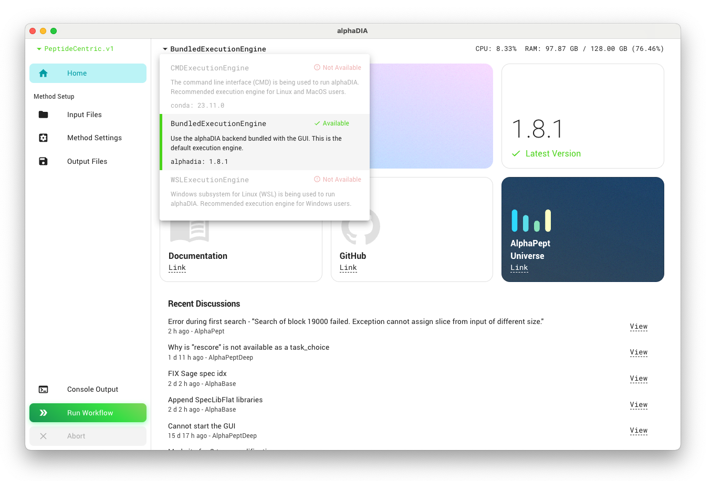
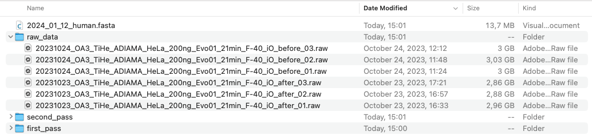
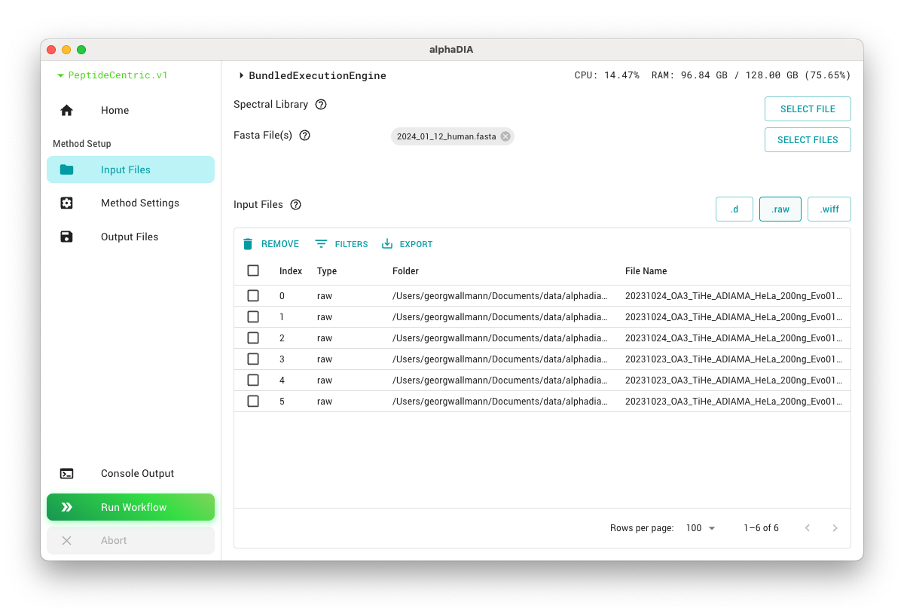
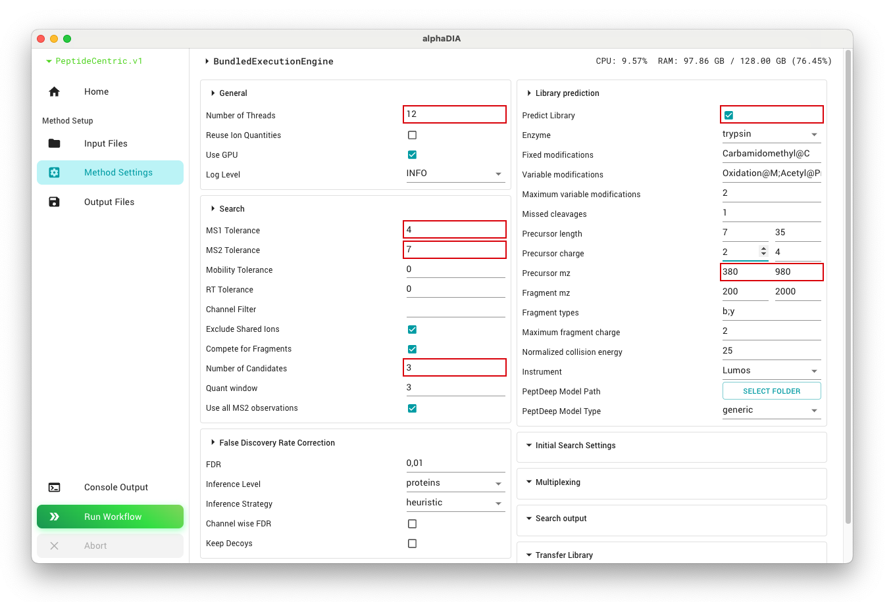
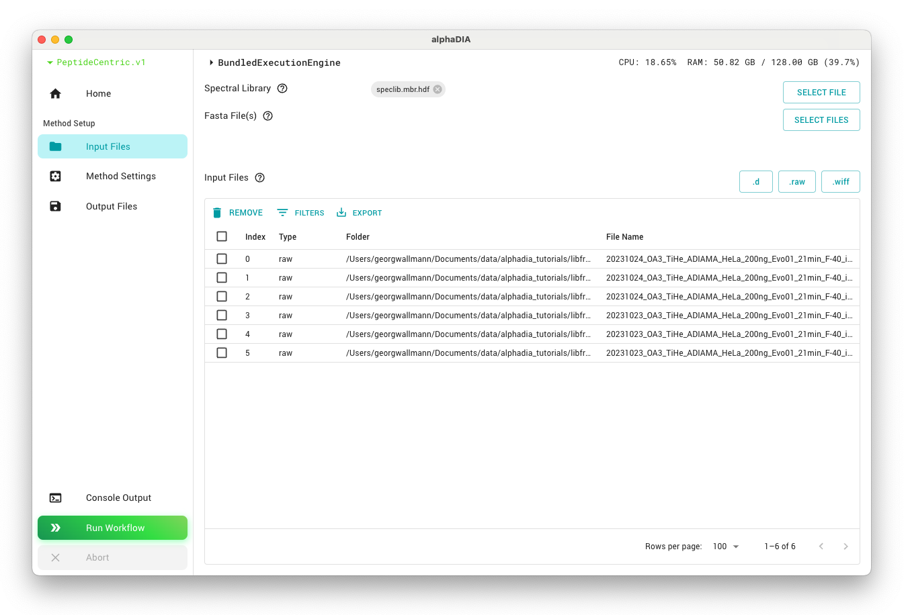
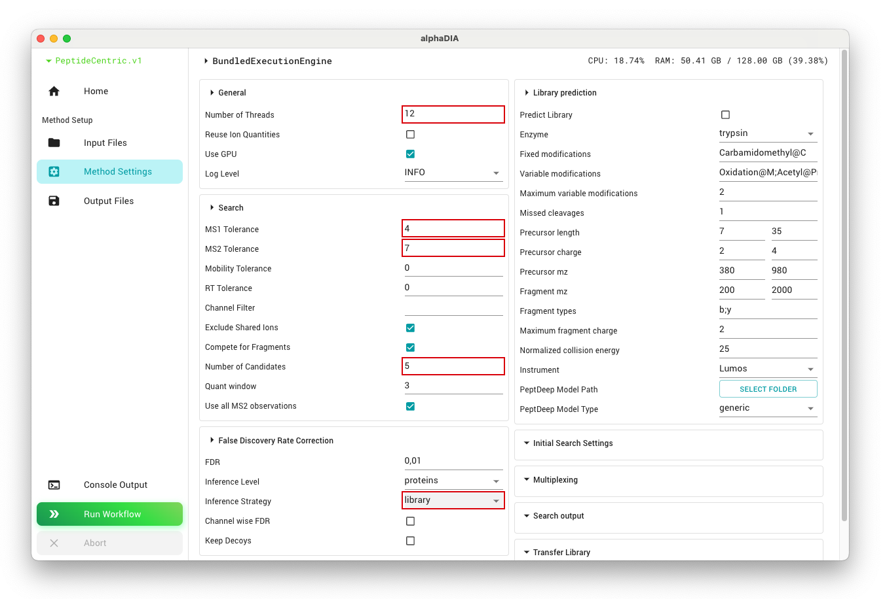
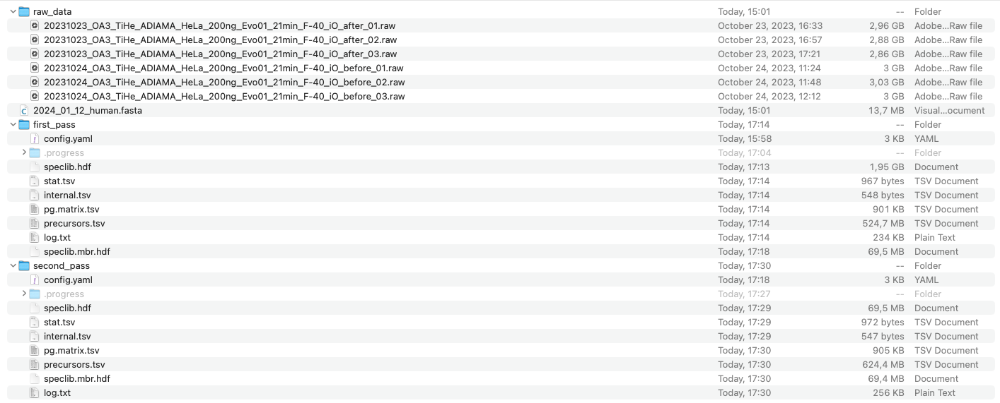

# Library-free DIA search using the GUI
**This tutorial was created using alphaDIA 1.8.1 - please be aware that there might be changes in your version**

## 1. Prerequisites
Make sure that you have a machine with at least 64 gigabytes of memory.
Please download the test data for this tutorial [here](https://datashare.biochem.mpg.de/s/Nsp8CaHMBf7FHq1). We will be using replicates of label-free bulk DIA data of HeLa digests acquired on the Orbitrap Astral.
Also make sure you have a valid alphaDIA installation including the GUI. The easiest option is the one-click installer, and a summary of all installation options can be found [here](<project:../installation.md>).
Also ensure the right execution engine has been selected and your version is up to date.

## 2. Project Structure
We will be performing two DIA searches: a first search for library generation and a second search for joined quantification. To accommodate this, we prepare the project directory to have a `first_pass` and a `second_pass` folder. You can change the project path in the `Output Files` tab

## 3. First search
To set up the first search:

1. Select all raw files by clicking the `.raw` button and add them to the file list.
2. Add the FASTA file which will be used for library prediction by clicking the `SELECT FILE` button.

For this search, most parameters can be left at their default values. To speed up processing, set `thread_count` to the number of logical cores you have available in your system. Also enable library prediction from FASTA and set the `precursor_mz` range to the range of the dataset `380`-`980` to predict only the relevant subset of precursors. By default, this search will have `Carbamidomethyl@C` as a fixed modification and up to two variable modifications of `Oxidation@M` and `Acetyl@Protein_N-term`.

For the search, we will use known `target_ms1_tolerance` of 4ppm and `target_ms2_tolerance` of 7ppm. These values are optimal for Orbitrap Astral data and can be reused. For lower resolution instruments, 10ppm or 15ppm might be optimal. If the optimal mass tolerance is not known, it can be set to `0` to activate automatic optimization. The `target_rt_tolerance` will also be set to `0` for automatic optimization. Lastly, we increase the number of peak groups `target_num_candidates` to use for deep-learning based scoring to `3`.

:::{tip}
Keeping track of optimized mass tolerance values for different instrument setups can save time in future analyses and ensure consistent results across projects.
:::

Start the first search by clicking the "Run Workflow" button. This will take between one and two hours depending on your system.

## 4. Second search
For the second search, we will use the library generated in the first search to quantify precursors across samples. Load all raw files as previously but remove the FASTA file. Instead, select the `speclib.mbr.hdf` as the spectral library.

For the second search, configure the `thread_count`, `target_ms1_tolerance`, and `target_ms2_tolerance` as before. Do not activate library prediction and instead set the `inference_strategy` to `library` to reuse the protein grouping from the first search. In the second search, it can be beneficial to increase the number of peak groups `target_num_candidates` to `5`. Values larger than `5` will most likely not have an effect, and we expect that future versions of alphaDIA will have an improved peak group selection making this step unnecessary.

Finally, start the search as before. This search will take only around 2 minutes per file.

## 5. Results
In the end, both folders should contain a full search output.
Use the precursor-level file `precursors.tsv` or the protein matrix in `pg.matrix.tsv` for any downstream analysis.

You can get a quick overview from the contents of the `stat.tsv` file. This two-step search strategy resulted in more than 115,000 precursors and 9,300 protein groups across the six files.

|   run                                                                |   channel  |   precursors  |   proteins  |   ms1_accuracy  |   fwhm_rt   |   fwhm_mobility  |   ms2_error  |   ms1_error  |   rt_error   |   mobility_error  |
|----------------------------------------------------------------------|------------|---------------|-------------|-----------------|-------------|------------------|--------------|--------------|--------------|-------------------|
|   20231024_OA3_TiHe_ADIAMA_HeLa_200ng_Evo01_21min_F-40_iO_before_03  |   0        |   118286      |   9356      |   0.597696      |   2.772127  |   0.000000       |   7.000000   |   4.000000   |   17.771221  |   0.100000        |
|   20231024_OA3_TiHe_ADIAMA_HeLa_200ng_Evo01_21min_F-40_iO_before_02  |   0        |   120276      |   9362      |   0.594870      |   2.748140  |   0.000000       |   7.000000   |   4.000000   |   25.645317  |   0.100000        |
|   20231024_OA3_TiHe_ADIAMA_HeLa_200ng_Evo01_21min_F-40_iO_before_01  |   0        |   119902      |   9355      |   0.596190      |   2.735716  |   0.000000       |   7.000000   |   4.000000   |   17.838232  |   0.100000        |
|   20231023_OA3_TiHe_ADIAMA_HeLa_200ng_Evo01_21min_F-40_iO_after_03   |   0        |   118977      |   9352      |   0.589555      |   2.733382  |   0.000000       |   7.000000   |   4.000000   |   25.810515  |   0.100000        |
|   20231023_OA3_TiHe_ADIAMA_HeLa_200ng_Evo01_21min_F-40_iO_after_02   |   0        |   116552      |   9359      |   0.590638      |   2.760179  |   0.000000       |   7.000000   |   4.000000   |   27.136864  |   0.100000        |
|   20231023_OA3_TiHe_ADIAMA_HeLa_200ng_Evo01_21min_F-40_iO_after_01   |   0        |   120054      |   9355      |   0.583652      |   2.725050  |   0.000000       |   7.000000   |   4.000000   |   18.924332  |   0.100000        |
