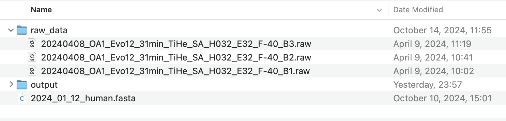
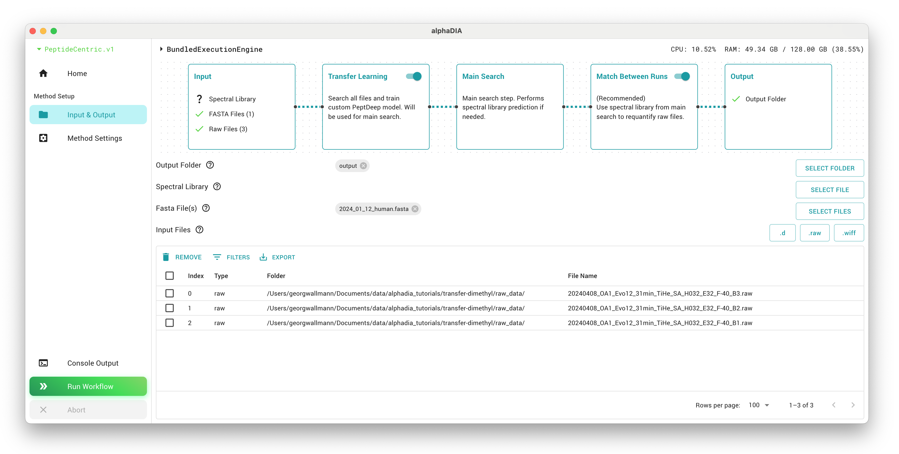
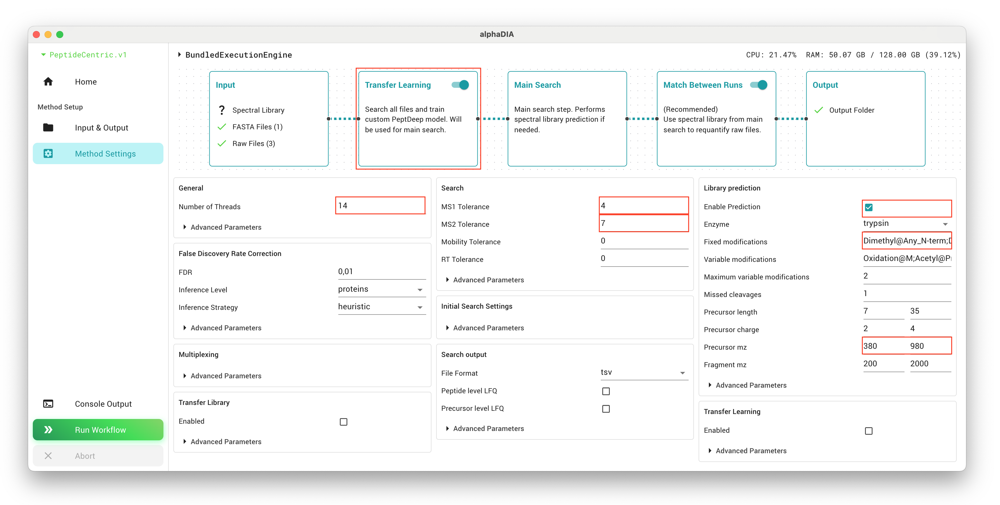
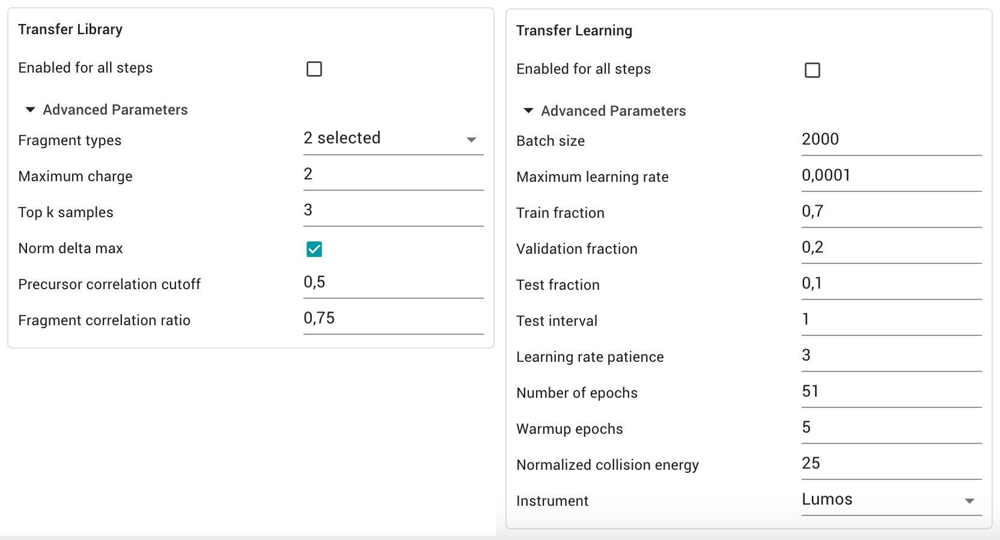
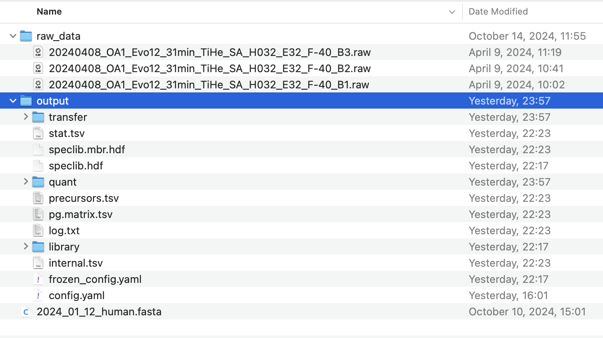

# DIA Transfer Learning for Dimethyl-Labeled Samples
**This tutorial was created using AlphaDIA 1.10.1 - please be aware that there might be changes in your version**

This guide demonstrates how to use AlphaDIA's transfer learning capabilities for analyzing samples which require learning the retention time and fragmentation behaviour. We will use replicates of dimethyl-labeled samples with a three step workflow that is fully supported in AlphaDIA 1.10.0 onwards via both GUI and CLI.

The integrated workflow eliminates the need for multiple separate searches and consists of:

1. **Transfer Learning step**: Generates a custom PeptDeep model fine-tuned to your specific samples,  predicting retention times, fragmentation patterns, and charge state of your dimethyl-labeled peptides.

2. **First search step**: Builds a spectral library using the fine-tuned model containing peptide information with accurate mass, retention time, and fragmentation predictions.

3. **Second search step**: Uses the library created in the previous step for cross-run quantification (Match Between Runs), providing the most accurate and comprehensive results.

The entire process is fully automated, with data seamlessly transferred between steps and optimal parameters applied at each phase. You configure the search workflow in the settings tab, and AlphaDIA automatically handles information passing between search steps and activates required settings for transfer learning and MBR.

## Prerequisites

**This guide requires AlphaDIA 1.10.0 or higher.**

Before starting, ensure you have:
- A machine with at least 64 gigabytes of memory
- Test data available for download [here](https://datashare.biochem.mpg.de/s/1GiKQSwlPf6YlMm) (replicates of dimethyl-labeled tryptic HeLa digests with light isotope)
- Valid AlphaDIA installation with GUI (one-click installer recommended)
- The BundledExecutionEngine selected as your execution engine

Make sure you have a project folder set up with the raw data, fasta file and an output folder.

## Setting Up Your Project

### 1. Configure Input/Output

Launch AlphaDIA and configure your inputs. Set your output folder to a location of your choice where results will be stored. Select all raw files and add them to the file list. You'll also need to add the FASTA file which will be used for library prediction. Set your output folder to a location of your choice where results will be stored.

### 2. Configure the Multistep Search

#### 1. Method Settings
In the GUI, navigate to settings and activate "Transfer Learning step" and "Match Between Runs" second step. These options enable the complete multistep workflow.

All settings which we will configure will by default affect all three search steps. On top of these settings, AlphaDIA will make smart choices in the transfer learning and MBR search to make sure the right modules are switched on.

Set the `general.thread_count` parameter to match the number of logical cores available on your system. This will optimize performance by utilizing your available computing resources.

Enable library prediction from FASTA withg `library_prediction.enabled`, which is essential for the workflow. This allows AlphaDIA to generate a theoretical spectral library from your protein database.

The `library_prediction.precursor_mz` range should be set to match your dataset characteristics. For the example data, the range 380-980 is appropriate as it covers the mass range of the peptides in the sample. Setting this correctly helps focus the search on relevant precursors.

For dimethyl-labeled samples, you must specify the following fixed modifications by setting `library_prediction.fixed_modifications` to `Dimethyl@Any_N-term` and `Dimethyl@K`. These account for the chemical modifications added during sample preparation.

Add appropriate variable modifications to `library_prediction.variable_modifications` which may be present in your samples. For typical samples, `Oxidation@M` and `Acetyl@Protein_N-term` are common. Variable modifications account for potential post-translational or chemical modifications that may or may not be present on certain residues.

The tolerance settings are critical for search accuracy. Set `search.target_ms1_tolerance` to 4 ppm and `search.target_ms2_tolerance` to 7 ppm if you're using Orbitrap Astral or similar high-resolution instruments. For lower-resolution instruments, values of 10-15 ppm might be more appropriate. These values define how closely measured masses must match theoretical masses.

#### 2. Transfer Learning Settings

:::{warning}
As the settings apply to all steps, do not activate the transfer library and transfer learning module for all steps. AlphaDIA will activate this automatically for the search step if this step is part of the multistep workflow.
:::

If you want to have more control over the transfer learning step, we can use the advanced parameters in the "Transfer Learning" and "Transfer library" section. Have a look [here](../methods/transfer-learning.md) for a more detailed description.

**Transfer Library** For library creation we can configure which fragments, not yet annotated in the library, should be quantified in the training data. We can set the fragment types, including labile modification losses or neutral losses. We can also define filtering criteria to limit the library to high quality precursors.

**Transfer Learning** For transfer learning we can set the hyperparameters for training as well as the annotation of the model. Usually no changes are needed as an [automated](../methods/transfer-learning.md) learning rate schedule for optimal performance without overfitting is used.

### 3. Start the Workflow

With your settings configured, click the "Run Workflow" button to start the integrated multistep search process. The workflow executes in three automated phases.

## Results
### 1. Output Folder

After the workflow completes, your results will be organized as follows:

The final analysis results will be located in the root of your project folder. These are the primary files you'll use for your research.

Intermediate results from earlier steps are stored in subfolders named `transfer` and `library`, allowing you to examine the results of individual stages if needed.

For downstream analysis and interpretation, you'll primarily work with the results stored in the root of the output folder:

The precursor-level file `precursors.tsv`, which contains detailed information about all identified peptide precursors, including retention times, intensities, and confidence metrics.

The protein matrix file `pg.matrix.tsv`, which summarizes protein-level quantification across all your samples, making it ideal for comparative analyses.

If you wish to use the custom PeptDeep models developed during your analysis for future projects, you can find them in `transfer/peptdeep.transfer`. These models can be valuable for analyzing similar samples in the future.

### 2. Search Performance

The `stat.tsv` file provides a quick overview of the number of precursors and protein groups identified across your samples, along with other relevant performance metrics. This is useful for quickly assessing the success of your analysis.

|   Run                                                | Precursors (Transfer) | Precursors (First Search) | Precursors (Final) |
|------------------------------------------------------|------------------------|---------------------------|---------------------|
|   20240408_OA1_Evo12_31min_TiHe_SA_H032_E32_F-40_B3  |   39,425              |   57,757                 |   68,195            |
|   20240408_OA1_Evo12_31min_TiHe_SA_H032_E32_F-40_B2  |   39,062              |   58,165                 |   68,192            |
|   20240408_OA1_Evo12_31min_TiHe_SA_H032_E32_F-40_B1  |   34,720              |   60,075                 |   69,072            |

These numbers demonstrate how each step of the workflow contributes to increasing the number of identified precursors, with the final result identifying significantly more peptides than the initial transfer learning step alone.

The individual performance metrics of the peptdeep model are stored in `transfer/stats.transfer.tsv`. The Evaluation guide [here](evaluate_model.ipynb) explains how to analyze and visualize the learned peptdeep model.
