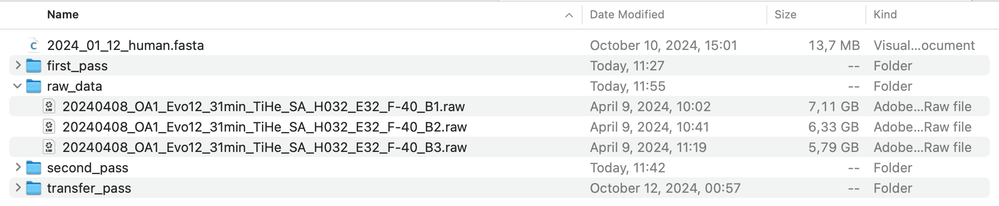
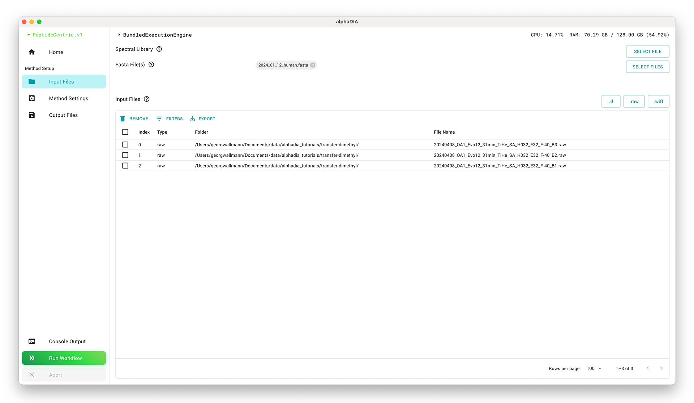
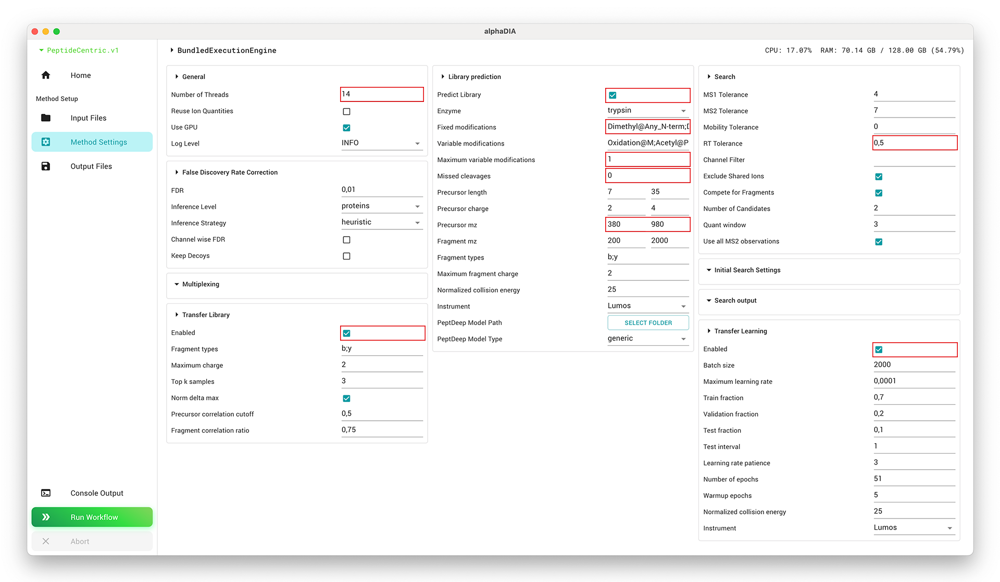
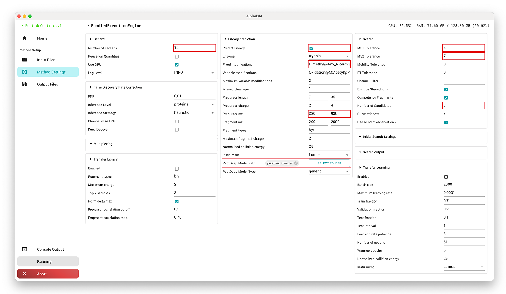
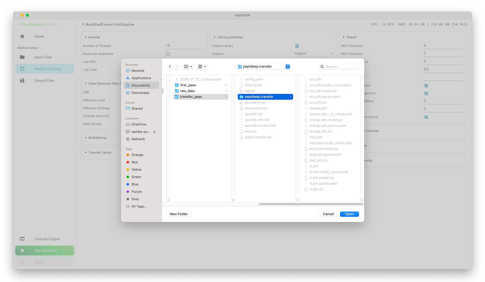
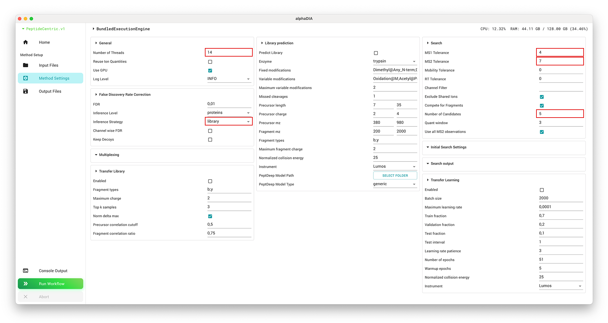

# DIA Transfer Learning for Dimethyl Labeled Samples

Note: from AlphaDIA 1.10.0, the multistep workflow is supported directly via GUI (and CLI), without the need for
multiple starts of AlphaDIA.
We recommend using this integrated multistep workflow, see [below](#integrated-multistep-workflow) for details.

Working through this tutorial might still be valuable, as it provides some insights and
intuition about the process and the relevant parameters.

## 1. Prerequisites
**This tutorial was created using AlphaDIA 1.8.1 - please be aware that there might be changes in your version.**

Make sure that you have a machine with at least 64 gigabytes of memory.
Please download the test data for this tutorial [here](https://datashare.biochem.mpg.de/s/1GiKQSwlPf6YlMm).
We will be using replicates of dimethyl-labeled tryptic HeLa digests. The samples are not multiplexed and only contain the natural light isotope.

Also, make sure you have a valid alphaDIA installation including the GUI. The easiest option is the one-click installer, and a summary of all installation options can be found [here](<project:../installation.md>).
Also, ensure the right execution engine has been selected and your version is up to date.

## 2. Project Structure
For this search, we will add an additional step for transfer learning before we perform the library building and quantification. Create a project folder and a `transfer_pass` subfolder for the transfer learning.
Create two additional subfolders, `first_pass` and `second_pass`, for the two subsequent DIA searches.


## 3. Transfer Learning Search
To set up the transfer learning search, select all raw files and add them to the file list. Also, add the FASTA file which will be used for library prediction.


### 3.1 Library Prediction
The strategy for the transfer learning search is to predict a spectral library from a FASTA digest using an imperfect model to generate training data used to fine-tune a PeptDeep model.
First, set the `thread_count` to the number of logical cores available on your system. Enable library prediction from FASTA and set the `precursor_mz` range to the range of the dataset `380`-`980` to predict only the relevant subset of precursors. We will use `Dimethyl@Any_N-term` and `Dimethyl@K` as fixed modifications. As this search is using an imperfect general PeptDeep model, it cannot benefit from reducing the search space using retention time and mobility predictions. We will therefore reduce the search space by only allowing one variable modification of `Oxidation@M` and `Acetyl@Protein_N-term` and no missed cleavages.

### 3.2 Search Settings
To account for the suboptimal retention time prediction, we will not use automatic retention time optimization. Instead, we will set the `target_rt_tolerance` to `0.5`, which will use 50% of the total gradient length as tolerance. Thereby, highly deviating precursors that pass the FDR threshold will be included in the training data, and the model will learn to predict their behavior.

For the search, we will use a known `target_ms1_tolerance` of 4 ppm and `target_ms2_tolerance` of 7 ppm. These values are optimal for Orbitrap Astral data and can be reused. For lower-resolution instruments, 10 ppm or 15 ppm might be optimal.

### 3.3 Transfer Learning
Finally, we will activate the training dataset generation and transfer learning. By doing so, alphaDIA will first requantify all precursors identified at 1% FDR, including fragment series and types not previously annotated in the library. In this example, we will use the default settings, which include b and y ions with up to two charges. Then, automated transfer learning will be performed. The model will be saved with a given NCE and instrument encoding, which must be set when loading the model.



Set the output folder to `transfer_pass` and start the search by clicking the "Run Workflow" button. This will take between one and two hours, depending on your system.

### 3.4 Transfer Library Results
Following the search, you will get a summary of the transfer learning library. In this case, we can see that 113,217 precursors were used to build the library. There are also statistics on the modifications and MS2 quality spectra, which are less affected by DIA co-isolation and should be used for benchmarking spectral similarity with pure DDA data. The training data will be saved as a spectral library in `transfer_pass/speclib.transfer.hdf`.

```
0:41:01.598992 PROGRESS: ======== Building transfer library ========
0:41:15.456574 INFO: Performing quality control for transfer learning. Normalize by delta: True Precursor correlation cutoff: 0.5 Fragment correlation cutoff: 0.75
0:41:29.940710 INFO: Built transfer library using 3 folders and 4 processes
0:41:30.278516 INFO: Modification                    Total      Unique   Total MS2  Unique MS2
0:41:30.278701 INFO: Acetyl@Protein_N-term           2,646       1,096       1,128         504
0:41:30.278762 INFO: Dimethyl@Any_N-term           110,571      48,560      42,640      20,884
0:41:30.278810 INFO: Dimethyl@K                     59,962      25,985      24,732      11,955
0:41:30.278858 INFO: Oxidation@M                     8,471       4,145       1,727         940
0:41:30.278902 INFO:                                     0           0           0           0
0:41:30.278937 INFO: ------------------------- ------------------------------------------------
0:41:30.279108 INFO: Total                         113,217      49,656      43,768      21,388
0:41:30.279137 INFO: Writing transfer library to disk
```

### 3.5 Transfer Learning Results
This data is then used to train PeptDeep models for retention time, ion mobility, charge state distribution, and fragmentation prediction. The data is split into training, validation, and test datasets. Here, we can see that 11,322 precursors were used for testing, and we improved R² from 0.60 to 0.98 on the test dataset. You can find all metrics in the log file as well as in the `stats.transfer.tsv` file in the `transfer_pass` folder.

```
0:41:30.820343 PROGRESS: Train PeptDeep Models
0:41:31.247622 INFO: Device set to mps
0:41:40.803595 PROGRESS:  Model tested on all datasets with the following metrics:
0:41:40.803764 PROGRESS:  l1_loss                       : 0.2039
0:41:40.803798 PROGRESS:  r_square                      : 0.6026
0:41:40.803823 PROGRESS:  r                             : 0.7763
0:41:40.803844 PROGRESS:  slope                         : 0.9964
0:41:40.803863 PROGRESS:  intercept                     : -0.1976
0:41:40.803879 PROGRESS:  abs_error_95th_percentile     : 0.4121
0:41:40.803951 PROGRESS:  Fine-tuning RT model with the following settings:
0:41:40.803977 INFO:  Train fraction:      0.70     Train size:      79,252
0:41:40.803996 INFO:  Validation fraction: 0.20     Validation size: 22,643
0:41:40.804012 INFO:  Test fraction:       0.10     Test size:       11,322
0:42:01.703788 PROGRESS:  Epoch 0   Lr: 0.00004   Training loss: 0.1858   Validation loss: 0.1966
0:42:07.452531 PROGRESS:  Epoch 1   Lr: 0.00006   Training loss: 0.1760   Validation loss: 0.1797
0:42:12.941546 PROGRESS:  Epoch 2   Lr: 0.00008   Training loss: 0.1588   Validation loss: 0.1612
0:42:18.587773 PROGRESS:  Epoch 3   Lr: 0.00010   Training loss: 0.1405   Validation loss: 0.1416
0:42:23.996033 PROGRESS:  Epoch 4   Lr: 0.00012   Training loss: 0.1216   Validation loss: 0.1189
...
0:47:08.569942 PROGRESS:  Epoch 50  Lr: 0.00012   Training loss: 0.0200   Validation loss: 0.0204
0:47:16.813396 PROGRESS:  Model tested on test dataset with the following metrics:
0:47:16.813515 PROGRESS:  l1_loss                       : 0.0203
0:47:16.813542 PROGRESS:  r_square                      : 0.9768
0:47:16.813565 PROGRESS:  r                             : 0.9883
0:47:16.813584 PROGRESS:  slope                         : 1.0006
0:47:16.813606 PROGRESS:  intercept                     : 0.0011
0:47:16.813627 PROGRESS:  abs_error_95th_percentile     : 0.0574
```

## 4. First Search
We will now use our custom PeptDeep model to perform a regular two-step search as recommended for DIA data. Select all raw files and the FASTA file in the input and set the output folder to `first_pass`.


### 4.1 Search Settings
We will use the same settings as in the regular two-step workflow. Set the `thread_count` to the number of logical cores available on your system. Enable library prediction from FASTA and set the `precursor_mz` range to 380-980. Use `Dimethyl@Any_N-term` and `Dimethyl@K` as fixed modifications, and allow two variable modifications each of `Oxidation@M` and `Acetyl@Protein_N-term` and one missed cleavage. Set the `target_ms1_tolerance` to 4 ppm and `target_ms2_tolerance` to 7 ppm. For retention time optimization, set `target_rt_tolerance` to 0 for automatic optimization and set the number of peak groups `target_num_candidates` to use for deep-learning based scoring to 3.

:::{important}
Make sure that a valid FASTA file is selected as input and library prediction is enabled. Both the transfer learning and the first search will use library prediction.

Make sure to disable the modules from the previous steps `Transfer Library > Disabled` and `Transfer Learning > Disabled`.
:::



Finally, we select our fine-tuned PeptDeep model located at `transfer_pass/peptdeep.transfer` and make sure that the instrument and NCE are set the same as in the transfer learning step.



Start the first search by clicking the "Run Workflow" button.

## 5. Second Search
For the second search, we'll use the library generated in the first search to quantify precursors across samples.

### 5.1 Search Settings
Load all raw files as previously but remove the FASTA file. Instead, select the `speclib.mbr.hdf` from the first search as the spectral library. Configure the `thread_count`, `target_ms1_tolerance`, and `target_ms2_tolerance` as in the first search. Set the `inference_strategy` to `library` to reuse the protein grouping from the first search. In this second search, increase the number of peak groups `target_num_candidates` to 5.


Start the second search as before. This search will be significantly faster than the two before.

## 6. Results
After completing both searches, you'll find full search outputs in both the `second_pass` folder. For downstream analysis, use the precursor-level file `precursors.tsv` or the protein matrix in `pg.matrix.tsv`. If you want to use the PeptDeep models, you can find them in `transfer_pass/peptdeep.transfer`.

You can get a quick overview from the contents of the `stat.tsv` file in the `second_pass` folder. This will show you the number of precursors and protein groups identified across your samples, along with other relevant metrics.

Altough the different parameters do not allow for fair comparison of absolut numbers between steps, we can still get an idea how transfer learning affects the number of identified precursors.

|   run                                                | precursors transfer_pass | precursors first_pass | precursors second_pass |
|------------------------------------------------------|--------------------------|-----------------------|------------------------|
|   20240408_OA1_Evo12_31min_TiHe_SA_H032_E32_F-40_B3  |   39145                  |   58433               |   67846                |
|   20240408_OA1_Evo12_31min_TiHe_SA_H032_E32_F-40_B2  |   38212                  |   57357               |   68099                |
|   20240408_OA1_Evo12_31min_TiHe_SA_H032_E32_F-40_B1  |   40113                  |   58840               |   67861                |


# Integrated multistep workflow
The multistep workflow described by the above tutorial is supported directly via GUI (and CLI), without the need for
multiple starts of AlphaDIA.

In the GUI, locate the "Multi-step Search" section and activate "Add 'transfer learning' step"
and/or "Add 'second search' step". Set the rest of parameters as desired and start the search.


This will orchestrate the individual search steps by transferring the data between the steps
and by setting the configuration parameters that are specific to each step.

For the "transfer" step, this is `transfer_library.enabled=True` and `transfer_learning.enabled=True`
(note that you might also want to enable the "Transfer library" step, cf. [above](#33-transfer-learning))
For the "mbr" step, this is `fdr.inference_strategy='library'` and `search.target_num_candidates=5`.

Any other parameter set via GUI (e.g. `thread_count`)
will apply to all steps. Here, the exceptions are `search.target_ms1_tolerance` and `search.target_ms2_tolerance`, which will be overwritten with
optimal values determined in the previous step. The intermediate results are stored in subfolders `transfer` and `library`,
respectively. As usual, you will find the final results in the root of the project folder.

If you use the CLI, add the following to your `config.yaml` to enable the multistep search:
```yaml
multistep_search:
  transfer_step_enabled: True
  mbr_step_enabled: True
```
Details on the internals of the multistep search can be found in `multistep.yaml`.

In case the multistep search fails at some step, you can restart the failed step by
using the `full_config.yaml` file that is stored in the respective subfolder. You can of course edit
the configuration file in order to fix the issue that caused the failure.
