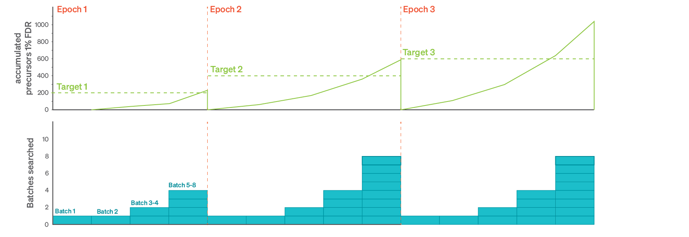

# Calibration

## Calibration and optimization
The first step of every alphaDIA entails the calibration of the empirical or fully predicted spectral library. This step has two main purposes: 1. Removing the systematic deviation of observed and library values and 2. Optimizing the size of the search space to reflect the expected deviation from the library values. For DIA search this means calibration and optimization of retention time, ion mobility, precursor m/z and fragment m/z.

AlphaDIA uses a iterative calibration schedule consisting of epochs. Every epoch, a defined number of precursors need to be identified at 1% FDR before calibration and optimization is performed and the next epoch is started (dashed green line). For the first epoch this will be `recalibration_target: 200` precursors, for the second `400` for the third `600` etc. Within each epoch, increasing number of batches of size `batch_size: 8000` are searched and scored and aggregated, following an exponential batch plan (blue).



If one epoch has accumulated enough confident target precursors, they are calibrated to the observed values using locally estimated scatterplot smoothing (LOESS) regression. For calibration of fragment m/z values, up to 5000 (but at least 500) of the best fragments according to their  XIC correlation are used. For precursor calibration all precursors passing 1% FDR are used.
For optimizing the search space, tolerances like retention time, ion mobility and m/z ratios need to be reduced. The goal is to cover the expected spectrum space but reduce it as much as possible to accelerate search and gain statsitical power. Starting with initial tolerances defined in `search_initial`.  At the end of every epoch the 95% deviation after calibration is adopted as new tolerance until the target tolerances defined in the `search` section are reached.

The search is finished as soon as the minimum numberof epochs `min_epochs` has passed and all tolerances have been to the target tolerances defined in `search`.
## Configuring the calibration schedule

```yaml
calibration:
  # minimum number of times (epochs) the updated calibration target has to been passed
  min_epochs: 3

  # Number of precursors searched and scored per batch
  batch_size: 8000

  # recalibration target for the first epoch. For subsequent epochs, the target will increase by this amount.
  recalibration_target: 200

search_initial:
  # Number of peak groups identified in the convolution score to classify with target decoy comeptition
  initial_num_candidates: 1

  # initial ms1 tolerance in ppm
  initial_ms1_tolerance: 30

  # initial ms2 tolerance in ppm
  initial_ms2_tolerance: 30

  # initial ion mobility tolerance in 1/K_0
  initial_mobility_tolerance: 0.08

  # initial retention time tolerance in seconds
  initial_rt_tolerance: 240
```

## Calibration using LOESS
Individual properties like the retention time deviate from their library values and need to be calibrated (a). As a nonlinear but stable method, locally estimated scatterplot smoothing (LOESS) using both density and uniformly distributed kernels is used. (b) A collection of polynomial kernels is fitted to uniformly distributed subregions of the data. These consist of first and second degree polynomials basis functions of the calibratable property. (c) The individual functions are combined and smoothed using tricubic weights. (d) Combining the kernels with their weighting functions allows to approximate the systematic deviation of the data locally. (e), The sum of the weighted kernels can then be used for continuous approximation and calibration of retention times. The architecture is built on the scikit-learn package and can be configured to use different hyperparameters and arbitrary predictors for calibration.


## Configuring the LOESS model

The type of model, the hyperparameters and the columns used as input and target for calibration can be set in the `calibration_manager` section of the configuration file.

```yaml
calibration_manager:
  - name: fragment
    estimators:
      - name: mz
        model: LOESSRegression
        model_args:
          n_kernels: 2
        input_columns:
          - mz_library
        target_columns:
          - mz_observed
        output_columns:
          - mz_calibrated
        transform_deviation: 1e6
  - name: precursor
    estimators:
        - name: mz
          model: LOESSRegression
          model_args:
            n_kernels: 2
          input_columns:
            - mz_library
          target_columns:
            - mz_observed
          output_columns:
            - mz_calibrated
          transform_deviation: 1e6
        - name: rt
          model: LOESSRegression
          model_args:
            n_kernels: 6
          input_columns:
            - rt_library
          target_columns:
            - rt_observed
          output_columns:
            - rt_calibrated
        - name: mobility
          model: LOESSRegression
          model_args:
            n_kernels: 2
          input_columns:
            - mobility_library
          target_columns:
            - mobility_observed
          output_columns:
            - mobility_calibrated

```
