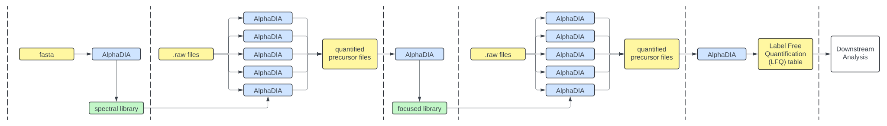

## Distributed AlphaDIA search on HPCL

This guide deals with setting up a distributed search in AlphaDIA, with the following prerequisites:
- A Linux (Ubuntu) HPCL system with Slurm Workload Manager installed. All resource management is handled by Slurm, AlphaDIA does not select, manage or monitor worker nodes.
- The distributed search requires absolute paths for each raw file, saved in the second column of a two-column .csv document. Simpler structures that e.g. process all files in a given directory are disfavored as large cohorts frequently consist of rawfiles spread across a number of subfolders.
- An Anaconda environment called "alphadia" with _mono_ and _alphadia_ installed (for installing _mono_, see https://github.com/MannLabs/alpharaw#installation)

## Distributed search concept



Compared to a linear two step search, distributing the raw file search steps offers a significant advantage in speed. At the most extreme, N files could be searched on N machines in parallel, completely decoupling search time from the number of files. In practice, not all steps of a search can be easily parallelized (i.e. steps which require knowledge of all files at the same time). Additionally, processing nodes available are never unlimited, requiring a chunking approach to ensure the maximum amount of parallelization with a given number of processing nodes. The diagram above summarizes these steps, indicating parallel AlphaDIA instances for first and second pass fo raw file searches.

## Steps to set up a search

1. Set up an empty search directory on your HPCL partition. One directory corresponds to one study, i.e. one set of raw files, fasta/library and search configuration.
2. Copy all files from alphadia/misc/distributed_search into the search directory
3. If no .csv file with rawfile paths exists, it can be obtained by running **discover_project_files.py** from the search directory.
4. Set first and second search configurations in **first_config.yaml** and **second_config.yaml**. For example, number of precursor candidates and inference strategy, as well as mass tolerances may differ between first and second search.
Leave all the predefined settings in the two .yaml files as they are.
5. Set the search parameters in **outer.sh**. While these can also be provided as command line arguments, it is convenient to set them in **outer.sh** itself. This file requires the following settings:
    - input_directory: the search directory
    - input_filename: the .csv file containing rawfile paths
    - target_directory: the directory where intermediate and final outputs are written (mind that slow read/write speeds to this location may slow down your search)
    - library_path (optional, will be reannotated if fasta_path is provided and predict_library is set to 1): absolute path to a .hdf spectral library
    - fasta_path (optional if library_path is provided and predict_library is set to 0): absolute path to .fasta file
    - first_search_config_filename: name of .yaml file for the first search
    - second_search_config_filename: name of the .yaml file for the building the MBR library, second search and LFQ
6. Run **outer.sh** with the following search settings:
    - --nnodes (int): specifies how many nodes can be occupied. Rawfile search will be distributed across these nodes. If there are 5 nodes and 50 raw files, the search will take place on 5 nodes in chunks of 10 rawfiles each.
    - --ntasks_per_node (int): default to 1, some HPCL systems allow for multiple tasks to run on one node
    - --cpus (int): default to 12, specifies how many CPUs shall be used per task
    - --mem (str): default to '250G', specifies RAM requirements for each task.
    **HPCL systems may be set to restrict user resources to certain limits. Make sure the above parameters comply with your HPCL setup.**
    - --predict_library (1/0): default to 1, whether to predict a spectral library from a given fasta
    - --first_search (1/0): default to 1, whether to search all files with the initial spectral library
    - --mbr_library (1/0): whether to aggregate first search results into a focused "MBR" library
    - --second_search (1/0): whether to perform a second search with the focused MBR library
    - --lfq (1/0): whether to perform LFQ quantification of the second search results

#### A typical call for running the search could look like this:

```console
sbatch outer.sh --nnodes 3 --search_config search.config
```
where the 'search.config' contains the name of the .csv file containing rawfile paths and other settings, and
```console
--nnodes 3
```
indicates that the search will be parallelized across three nodes.

#### Running the search creates five subdirectories in the target folder:

- _predicted_speclib_: If spectral library prediction was set, this folder contains the .hdf spectral library
- _first_search_: Contains one subdirectory for each processing chunk. AlphaDIA subprocesses for the first search are run from these chunks and their specific config.yaml files. Precursor and fragment datasets from these searches are saved into the _mbr_library_ folder
- _mbr_library_: Contains one chunk, since the library is built from all first search results.
- _second_search_: Analogous to _first_search_, one subdirectory is created for each chunk of rawfiles that are searched with the mbr_library. Precursor and fragment datasets from these searches are saved into the _lfq_ folder.
- _lfq_: Analogous to _mbr_library_, contains one chunk which runs label free quantification (LFQ) on each output from the second search. After all search steps are completed, the final precursor and protein tables are saved here.
