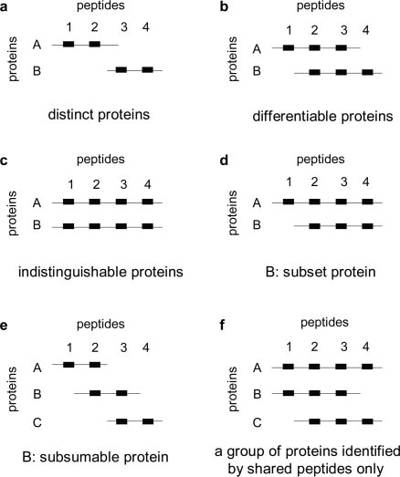

## Protein Inference

Bottom-up proteomics search engines aim to identify and quantify peptides from experimental data. Yet, human researchers are generally interested in the presence or absence, as well as the abundance of gene products, i.e. proteins, which consist of many peptides. Therefore, there is a need to translate peptide identifications into protein identifications before meaningful conclusions on the measured proteome can be drawn.

The approach of _maximum parsimony_ follows the principle of _Occam's Razor_, where a peptide (or precursor) is treated as a single piece of evidence, and we aim to explain all observed precursors with the smallest possible set of proteins. The approach outlined here is based on [Nesvizhskii, Alexey I., and Ruedi Aebersold. \"Interpretation of shotgun proteomic data.\" Molecular & cellular proteomics 4.10 (2005)].

As an example of why grouping is necessary, consider Proteins A with peptides [1, 2, 3, 4] and B with peptides [1, 2, 3]. If a proteomics experiment identifies peptides [1, 2, 3, 4], the parsimonious explanation for the observed evidence is that protein A was present in the sample, since it alone is sufficient to explain the observed peptides. A "greedy" approach would conclude the presence of A and B, and _protein inference_ via _protein grouping_ aims to resolve these two extremes.

Viewed through the lens of parsimonious protein grouping, A and B would belong to the same group, which is reported as a single ID "A;B" in the end. If only a single protein is allowed per ID, "A" should be reported and "B" omitted.

## AlphaDIA grouping and parsimony approach

<ol>
    <li> Extract the columns 'precursor_idx' and 'ids' (proteins or genes) from the table of identified psms.</li>
    <li> Reshape into id-centric view: the first column contains one row per id, the second column contains that id's set of associated precursor indices.</li>
    <li> Perform grouping inspired by the "greedy set cover" algorithm:
        <ol> 
            <li> Save the id with the longest set of precursors as the "query" and remove it from the table.</li>
            <li> Iterate over the remaining "subject" ids. From each subject's precursor set, remove all precursors that overlap with the query's precursor set. If a subject's precursor set goes to zero, it is considered subsetted by the query, and the two ids are summarized into one group as a semicolon (;) separated string.</li>
            <li> Repeat until all remaining ids have a precursor set of length zero, or the last available id has been considered as a query. </li>
        </ol>
    </li>
</ol>

The above approach is largely based on a greedy set cover implementation described in [https://www.cs.umd.edu/class/fall2017/cmsc451-0101/Lects/lect09-set-cover.pdf], and a general description of protein grouping from [Nesvizhskii, Alexey I., and Ruedi Aebersold. "Interpretation of shotgun proteomic data." Molecular & cellular proteomics 4.10 (2005)]. Of note, several ambiguous cases can arise for ids which have the exact same number of precursors. In this case, the algorithm will pick the first id in the list, which resolves these cases arbitrarily. Future implementations will employ a weighted set cover approach, taking into account precursor abundances to resolve ties.

The above mentioned publication lists six cases of protein grouping which must be resolved. Together with circular protein groups, a sub-case of subsumable proteins, these cases are covered by AlphaDIA's grouping implementation.

Adapted from: Nesvizhskii, Alexey I., and Ruedi Aebersold. "Interpretation of shotgun proteomic data." Molecular & cellular proteomics 4.10 (2005): 1419-1440. Figure 5.

## Algorithmic implementation:

The above cases are implemented in a jupyter notebook: [protein_grouping_tutorial.ipynb](../../nbs/tutorial_nbs/protein_grouping_tutorial.ipynb).
    

    

