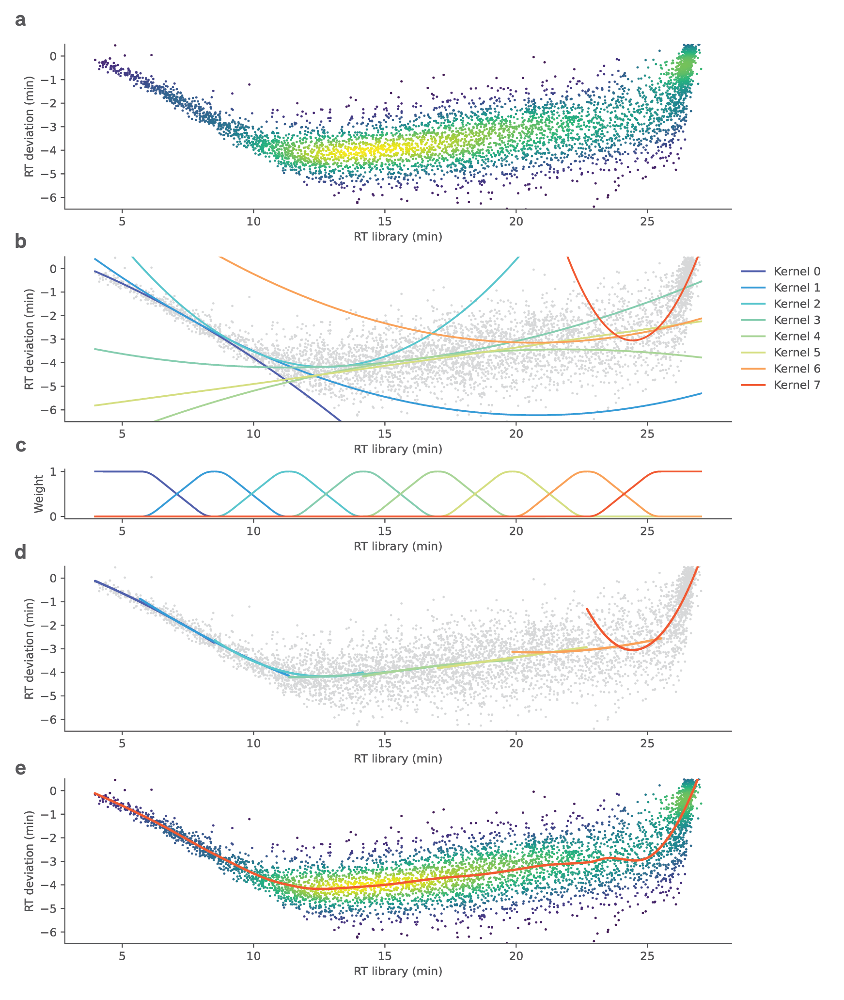

# Search Parameter Optimization

## Calibration and optimization
### Overall process
The first step of every AlphaDIA run is the optimization of search parameters and the calibration of the empirical or fully predicted spectral library to the observed values. This step has two main purposes: 1) removing the systematic deviation of observed and library values, and 2) optimizing the size of the search space to reflect the expected deviation from the library values. For DIA search this means calibration and optimization of certain parameters: retention time, ion mobility, precursor m/z and fragment m/z. The process of iterative calibration and optimization is illustrated below.


Optimization can be performed in either a targeted or automatic manner. In targeted optimization, the search space is progressively narrowed until a target tolerance is reached for a given parameter. In automatic optimization, the search space is progressively narrowed until an internal algorithm detects that further narrowing will reduce the confident identification of precursors (either by directly assessing the proportion of the library which has been detected or using a surrogate metric, such as the mean isotope intensity correlation for precursor m/z tolerance), at which point the optimal value is selected for search. Automatic optimization can be triggered by setting the target tolerance to 0.0 (or a negative value). It is possible to use targeted optimization for some parameters and automatic optimization for others; currently, it is recommended to use targeted optimization for precursor m/z, fragment m/z and ion mobility, and automatic optimization for retention time.

AlphaDIA iteratively performs calibration and optimization based on a subset of the spectral library used for search. The size of this subset is adjusted according to an exponential batch plan to balance accuracy and efficiency. A defined number of precursors, set by the ``optimization_lock_target`` (default: 200), need to be identified at 1% FDR before calibration and optimization are performed. If fewer precursors than the target number are identified using a given step of the batch plan, AlphaDIA will search for precursors from the next step of the batch plan in addition to those already searched. If more precursors than the target number are identified, AlphaDIA will check if any previous step of the batch plan is also likely to yield at least the target number, in which case it will use the smallest such step of the batch plan for the next iteration of calibration and optimization. In this way, AlphaDIA ensures that calibration is always performed on sufficient precursors to be reliable, while calibrating on the smallest-possible subset of the library to maximize efficiency.

The process of choosing the best batch step for calibration and optimization is illustrated in the figure below, which shows optimization and calibration over seven iterations; the batch size is increased in the first iteration until sufficient precursors are detected, and subsequently reduced when the proportion is sufficiently high that a previous step should reach the target as well; if, however, fluctuations in the number of identifications mean that not enough precursors are actually identified, the next step in the batch plan will be searched as well to ensure that calibration is always performed on at least the target number of precursors.


### Calibration
If enough confident target precursors have been detected, they are calibrated to the observed values using locally estimated scatterplot smoothing (LOESS) regression. For calibration of fragment m/z values, a fixed number of up to 5000 of the best fragments according to their  XIC correlation are used. For precursor calibration all precursors passing 1% FDR are used. Calibration is performed prior to every optimization.

### Optimization
For optimizing the search space, tolerances like retention time, ion mobility and m/z ratios need to be reduced. The goal is to cover the expected spectrum space but reduce it as much as possible to accelerate search and gain statistical power. Search starts with initial tolerances as defined in `search_initial`.  For targeted optimization, the 95% deviation after calibration is adopted as the new tolerance until the target tolerances defined in the `search` section are reached. For automatic optimization, the 99% deviation plus 10% of the absolute value of the tolerance is adopted as the new tolerance, and search continues until parameter-specific convergence rules are met.

The optimization is finished as soon as the minimum number of steps `min_steps` has passed and all tolerances have either 1) reached the target tolerances defined in `search` if using targeted optimization, or 2) have converged if using automatic optimization.

## Configuring calibration and optimization
The configuration below will perform targeted optimization of precursor m/z, fragment m/z and ion mobility, and automatic optimization of retention time.

```yaml
calibration:
  # Number of precursors searched and scored per batch
  batch_size: 8000

  # minimum number of precursors to be found before search parameter optimization begins
  optimization_lock_target: 200

  # the maximum number of steps that a given optimizer is permitted to take
  max_steps: 20

  # the minimum number of steps that a given optimizer must take before it can be said to have converged
  min_steps: 2

search_initial:
  # Number of peak groups identified in the convolution score to classify with target decoy competition
  initial_num_candidates: 1

  # initial ms1 tolerance in ppm
  initial_ms1_tolerance: 30

  # initial ms2 tolerance in ppm
  initial_ms2_tolerance: 30

  # initial ion mobility tolerance in 1/K_0
  initial_mobility_tolerance: 0.08

  # initial retention time tolerance in seconds
  initial_rt_tolerance: 240

search:
  target_num_candidates: 2
  target_ms1_tolerance: 15
  target_ms2_tolerance: 15
  target_mobility_tolerance: 0.04
  target_rt_tolerance: 0

```

## Calibration using LOESS
Individual properties like the retention time deviate from their library values and need to be calibrated (a). As a nonlinear but stable method, locally estimated scatterplot smoothing (LOESS) using both density and uniformly distributed kernels is used. (b) A collection of polynomial kernels is fitted to uniformly distributed subregions of the data. These consist of first and second degree polynomials basis functions of the calibratable property. (c) The individual functions are combined and smoothed using tricubic weights. (d) Combining the kernels with their weighting functions allows to approximate the systematic deviation of the data locally. (e), The sum of the weighted kernels can then be used for continuous approximation and calibration of retention times. The architecture is built on the scikit-learn package and can be configured to use different hyperparameters and arbitrary predictors for calibration.



## Configuring the LOESS model

The type of model, the hyperparameters and the columns used as input and target for calibration can be set in the `calibration_manager` section of the configuration file.

```yaml
calibration_manager:
  - name: fragment
    estimators:
      - name: mz
        model: LOESSRegression
        model_args:
          n_kernels: 2
        input_columns:
          - mz_library
        target_columns:
          - mz_observed
        output_columns:
          - mz_calibrated
        transform_deviation: 1e6
  - name: precursor
    estimators:
        - name: mz
          model: LOESSRegression
          model_args:
            n_kernels: 2
          input_columns:
            - mz_library
          target_columns:
            - mz_observed
          output_columns:
            - mz_calibrated
          transform_deviation: 1e6
        - name: rt
          model: LOESSRegression
          model_args:
            n_kernels: 6
          input_columns:
            - rt_library
          target_columns:
            - rt_observed
          output_columns:
            - rt_calibrated
        - name: mobility
          model: LOESSRegression
          model_args:
            n_kernels: 2
          input_columns:
            - mobility_library
          target_columns:
            - mobility_observed
          output_columns:
            - mobility_calibrated

```
