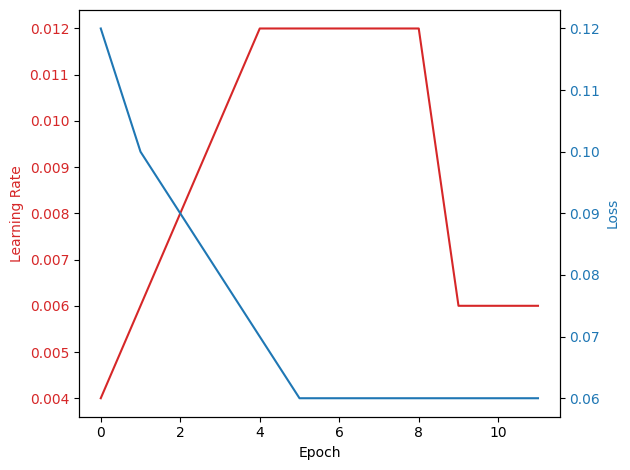

## Transfer Learning

Generally, transfer learning refers to the process of leveraging the knowledge learned in one model for better performance on a different task. A task is a vague term, but it essentially includes learning a different objective, for example, transitioning from regression to classification. It can also involve learning the same objective with a different loss function or optimizer, or using the same loss and objective but with different data. In cases where the dataset is too small to train a model from scratch without overfitting, we start from a pretrained model that has good performance on a larger dataset. This last type is the transfer learning we are using in alphaDIA.

## Transfer Learning for alphaDIA

In alphaDIA, we use the output obtained after the first search run and introduce a signal from the identified peptides to fine-tune the predictions from PeptDeep models on the custom dataset we are interested in. We then explore how this affects a second search run with fine-tuned models used to predict the spectral library.

Training neural networks, and specifically transformers (such as those used in MS2 prediction), usually requires a lot of hyperparameter fine-tuning. Users try out different parameters like learning rate and the number of epochs to see what works better. For users with limited experience, this may seem like a trial and error process that is very time-consuming. The goal of the transfer learning module in alphaDIA is to provide robustness with minimal intervention from users, thereby increasing the accessibility of such processes for users from all backgrounds with minimal experience in deep learning.


In this notebook, we will be going over the transfer learning done in alphaDIA, starting with two components that help achieve the robustness we are targeting: **Learning Rate Schedulers** and **Early Stopping**. If you understand these concepts and want to jump straight into how to use our APIs to fine-tune the model, skip to the [finetuning section](#transfer-learning-in-alphadia)


```python

from alphadia.transferlearning.train import CustomScheduler

```

## Learning Rate Scheduler

Learning rates are crucial parameters that define the magnitude of updates made to the model weights, essentially controlling "how fast we learn". While a higher learning rate might seem beneficial, it can cause the weights to converge quickly to sub-optimal values and oscillate around them. If the learning rate is too high, it can even cause the model to diverge by overshooting the weights. This is where learning rate schedulers come into play. A learning rate scheduler adjusts the learning rate of a neural network (or part of it) dynamically based on time/epochs or the loss of the model (more on that later).

For alphaDIA, we use a custom learning rate scheduler with two phases:

### 1) Warmup Phase
In this phase, the learning rate starts small and gradually increases over a certain number of "warmup epochs". Our default is **5**. This technique significantly helps in training transformers when using optimizers like Adam or SGD ([https://arxiv.org/abs/2002.04745](https://arxiv.org/abs/2002.04745)). Since we are not training from scratch, we set the default number of warmup epochs to 5. The user only needs to define the maximum learning rate and the number of epochs for warm-up. During this phase, the learning rate lr(t) is calculated as:

$$
\text{lr}(t) = \text{max\_lr} \times \left( \frac{t}{\text{number of warmup epochs}} \right)
$$

### 2) Reduce on Plateau LR Schedule
After the warmup phase, the learning rate reaches the maximum value set by the user and remains there until the training loss reaches a plateau. A plateau is defined as the training loss not significantly improving for a certain number of epochs, referred to as "patience". For this phase, we use the PyTorch implementation `torch.optim.lr_scheduler.ReduceLROnPlateau` with a default patience value of 3 epochs. 

This approach makes the fine-tuning process less sensitive to the user-defined learning rate. If the model is not learning for 3 epochs, it is likely that the learning rate is too high, and the scheduler will then reduce the learning rate to encourage further learning.


```python
"""
To show how our LR scheduler works, we will use a dummy optimizer with a dummy model parameters.
"""

import torch

NUM_WARMUP_STEPS = 5
MAX_LR = 0.01

class DummyModel(torch.nn.Module):
    def __init__(self):
        super(DummyModel, self).__init__()
        self.fc = torch.nn.Linear(1, 1)
    
    def forward(self, x):
        return self.fc(x)
    
model = DummyModel()
optimizer = torch.optim.Adam(model.parameters(), lr=MAX_LR)

```


```python
"""
Now since our lr scheduler uses reduce_lr_on_plateau, we need to pass the training loss per each epoch to the scheduler.
"""

# Dummy training loss
losses = [0.12,0.1, 0.09, 0.08, 0.07, 0.06, 0.06,0.06,0.06,0.06,0.06, 0.06] 
scheduler = CustomScheduler(optimizer, max_lr=MAX_LR, num_warmup_steps=NUM_WARMUP_STEPS)

learning_rates = []
for epoch, loss in enumerate(losses):
    scheduler.step(epoch, loss)
    learning_rates.append(optimizer.param_groups[0]['lr'])

fig, ax1 = plt.subplots()

color = 'tab:red'
ax1.set_xlabel('Epoch')
ax1.set_ylabel('Learning Rate', color=color)
ax1.plot(learning_rates, color=color)
ax1.tick_params(axis='y', labelcolor=color)

ax2 = ax1.twinx()  

color = 'tab:blue'
ax2.set_ylabel('Loss', color=color)  
ax2.plot(losses, color=color)
ax2.tick_params(axis='y', labelcolor=color)

fig.tight_layout() 
plt.show()
```

  
    


    

    


Notice how in the first 5 epochs the learning rate started from 
$\frac{\text{max\_lr}}{\text{number of epochs}} = \frac{0.01}{5} = 0.002$ 
and increased till it reached $0.01$ in the 5th epoch.

When the loss plateaus for more than 3 epochs (the value set for patience), the learning rate is halved. We will see how much this learning rate halving actually helps retention time (RT) and MS2 fine-tuning to consistently achieve much better performance without requiring extensive experimentation with hyperparameter changes.


```python
from alphadia.transferlearning.train import EarlyStopping
```

## Early Stopping

With the learning scheduler we are using, we could theoretically keep training indefinitely, as the learning rate is reduced whenever the loss becomes steady until it reaches an infinitesimally small value. However, there are two issues with this approach:

1. The performance gains when the learning rate is very small are often not significant enough to justify continued training.
2. Longer training times increase the risk of overfitting on the small dataset we are fine-tuning on.

To address these issues, we implement two measures:

### 1) Maximum Number of Epochs
We set the maximum number of epochs to 50. From our experiments, we find that 50 epochs are usually sufficient to achieve significant performance gains without spending unnecessary time/epochs on insignificant improvements.

### 2) Early Stopping
We use an Early Stopping implementation that monitors the validation loss and terminates the training if one of the following criteria is met for more than the patience epochs (this is different from the learning rate scheduler's patience value, but they are related, more on this later):

a) The validation loss is increasing, which may indicate overfitting.

b) The validation loss is not significantly improving, indicating no significant performance gains on the validation dataset.

The early stopping patience value represents the number of epochs we allow the model to meet the criteria without taking any action. This is because training neural networks with smaller batches can be a bit unstable, so we allow for some volatility before intervening. We set the early stopping patience to be a multiple of the learning rate scheduler patience. The idea is to give the learning rate scheduler a chance to address the problem before terminating the training.

It's important to note that there are many implementations of Early Stopping algorithms, some offering better performance against overfitting by monitoring the generalization gap (val_loss - train_loss). However, we found that the simple implementation we use is sufficient for our fine-tuning tasks.


```python
"""
To illustrate how our early stopping works we will try it on simulated validation losses in differnet cases and see how and when the early stopping is triggered.
"""
simulated_losses = {
    "diverging": [0.5, 0.3 ,0.2, 0.1, 0.125, 0.15, 0.2, 0.3, 0.5, 0.7, 1.0],
    "converging": [0.5, 0.3 ,0.2, 0.1, 0.05, 0.03, 0.02, 0.01, 0.005, 0.002, 0.0005],
    "not significantly improving" : [0.5, 0.3 ,0.2, 0.1, 0.07, 0.0695, 0.0689, 0.06883, 0.06878,0.06874, 0.06869],
}

stopped_at = {case: len(losses)-1 for case, losses in simulated_losses.items()}
for case, losses in simulated_losses.items():
    early_stopping = EarlyStopping(patience=3)
    for epoch, loss in enumerate(losses):
        continue_training = early_stopping.step(loss)
        if not continue_training:
            stopped_at[case] = epoch
            break

fig, ax = plt.subplots()
for case, losses in simulated_losses.items():
    ax.plot(losses, label="Loss "+case)
    ax.scatter(stopped_at[case], losses[stopped_at[case]], color='red')
ax.legend()
ax.set_xlabel("Epoch")
ax.set_ylabel("Validation Loss")
# remove axis
ax.spines['top'].set_visible(False)
ax.spines['right'].set_visible(False)
ax.spines['left'].set_visible(False)
ax.spines['bottom'].set_visible(False)
plt.show()

```


    

    


## Transfer Learning in alphaDIA

Our fine-tuning interface in the `FinetuneManager` has a method implemented for each model (RT, Charge, MS2). Each function fine-tunes the respective model and runs tests on the validation dataset every epoch. By the end of the fine-tuning process, the method returns a pandas DataFrame that includes all metrics accumulated throughout the epochs. This DataFrame contains the training loss, learning rate, and all test metrics for the model. Additionally, the method provides an evaluation of the model on the full dataset before fine-tuning, and another evaluation on a separate test dataset that is used only once after the fine-tuning. This is included to facilitate easier interpretation of how well the fine-tuning performed on the given dataset.

The metrics accumulated are calculated as the average over all validation samples and are as follows:

| Model   | Metrics |
|---------|---------|
| **RT**  | L1 loss, Linear regression analysis, 95th percentile of the absolute error |
| **Charge** | Cross Entropy, Accuracy, Precision, Recall |
| **MS2**    | L1 loss, Pearson Correlation Coefficient, Cosine Similarity, Spectral Angle, Spearman Correlation |


```python

tune_mgr = FinetuneManager(
    device="gpu",
    settings=settings)
tune_mgr.nce = 25
tune_mgr.instrument = 'Lumos'
```


## RT Fine-tuning


```python
transfer_lib.precursor_df = tune_mgr.predict_rt(transfer_lib.precursor_df)
plt.scatter(transfer_lib.precursor_df['rt_norm'], transfer_lib.precursor_df['rt_norm_pred'], s=1, alpha=0.1)
plt.xlabel('RT observed')
plt.ylabel('RT predicted')
```
    

    


```python
rt_stats = tune_mgr.finetune_rt(transfer_lib.precursor_df)

transfer_lib.precursor_df = tune_mgr.predict_rt(transfer_lib.precursor_df)

plt.scatter(transfer_lib.precursor_df['rt_norm'], transfer_lib.precursor_df['rt_norm_pred'], s=0.1, alpha=0.1)
plt.xlabel('RT observed')
plt.ylabel('RT predicted')

```

    2024-07-05 11:11:20>  RT model tested on all dataset with the following metrics:
    2024-07-05 11:11:20>  l1_loss                       : 0.2398
    2024-07-05 11:11:20>  r_square                      : 0.4829
    2024-07-05 11:11:20>  r                             : 0.6949
    2024-07-05 11:11:20>  slope                         : 0.5390
    2024-07-05 11:11:20>  intercept                     : 0.1113
    2024-07-05 11:11:20>  abs_error_95th_percentile     : 0.4317
    2024-07-05 11:11:20>  Fine-tuning RT model with the following settings:
    2024-07-05 11:11:20>  Train fraction:      0.70     Train size:      20226     
    2024-07-05 11:11:20>  Validation fraction: 0.20     Validation size: 5779      
    2024-07-05 11:11:20>  Test fraction:       0.10     Test size:       2889      
    2024-07-05 11:11:30>  Epoch 0   Lr: 0.00020   Training loss: 0.1619   validation loss: 0.1270
    2024-07-05 11:11:38>  Epoch 1   Lr: 0.00030   Training loss: 0.0657   validation loss: 0.0482
    ...
    2024-07-05 11:17:52>  Epoch 49  Lr: 0.00030   Training loss: 0.0128   validation loss: 0.0206
    2024-07-05 11:18:00>  Epoch 50  Lr: 0.00030   Training loss: 0.0128   validation loss: 0.0196
    2024-07-05 11:18:01>  RT model tested on test dataset with the following metrics:
    2024-07-05 11:18:01>  l1_loss                       : 0.0203
    2024-07-05 11:18:01>  r_square                      : 0.9229
    2024-07-05 11:18:01>  r                             : 0.9607
    2024-07-05 11:18:01>  slope                         : 0.9672
    2024-07-05 11:18:01>  intercept                     : 0.0147
    2024-07-05 11:18:01>  abs_error_95th_percentile     : 0.0846


    


```python
g = sns.relplot(data=rt_stats, x='epoch', y='value', hue='data_split', marker= 'o',dashes=False, col='metric_name', kind='line', col_wrap=2, facet_kws={'sharex': False, 'sharey': False, 'legend_out': False})
g.set_titles("{col_name}")
g.legend.set_title('Data split')

```


    

    


## Charge Fine-tuning


```python

charge_stats = tune_mgr.finetune_charge(psm_df=transfer_lib.precursor_df)
```

    2024-07-05 11:18:13>  Charge model tested on all dataset with the following metrics: 
    2024-07-05 11:18:13>  ce_loss                       : 0.5444
    2024-07-05 11:18:13>  accuracy                      : 0.6414
    2024-07-05 11:18:13>  precision                     : 0.3108
    2024-07-05 11:18:13>  recall                        : 0.2975
    2024-07-05 11:18:13>  Fine-tuning Charge model with following settings:
    2024-07-05 11:18:13>  Train fraction:      0.70     Train size:      20226     
    2024-07-05 11:18:13>  Validation fraction: 0.20     Validation size: 5779      
    2024-07-05 11:18:13>  Test fraction:       0.10     Test size:       2889      
    2024-07-05 11:18:24>  Epoch 0   Lr: 0.00020   Training loss: 0.6341   validation loss: 0.6309
    2024-07-05 11:18:35>  Epoch 1   Lr: 0.00030   Training loss: 0.4453   
    ...
    2024-07-05 11:27:54>  Epoch 50  Lr: 0.00015   Training loss: 0.0618   validation loss: 0.1364
    2024-07-05 11:27:55>  Charge model tested on test dataset with the following metrics: 
    2024-07-05 11:27:55>  ce_loss                       : 0.1476
    2024-07-05 11:27:55>  accuracy                      : 0.9515
    2024-07-05 11:27:55>  precision                     : 0.9107
    2024-07-05 11:27:55>  recall                        : 0.8994
    


```python
g = sns.relplot(data=charge_stats, x='epoch', y='value', hue='data_split', marker= 'o',dashes=False, col='metric_name', kind='line', col_wrap=2, facet_kws={'sharex': False, 'sharey': False, 'legend_out': False})
g.set_titles("{col_name}")
g.legend.set_title('Data split')

```


    

    


## MS2 Fine-tuning


```python
res = tune_mgr.predict_all(transfer_lib.precursor_df.copy(), predict_items=['ms2'])

precursor_after_df = res['precursor_df']
fragment_mz_after_df = res['fragment_mz_df']
fragment_intensity_after_df = res['fragment_intensity_df']
similarity_after_df = calculate_similarity(precursor_after_df, transfer_lib.precursor_df, fragment_intensity_after_df, transfer_lib.fragment_intensity_df)
print(similarity_after_df['similarity'].median())
plt.scatter(similarity_after_df['index'], similarity_after_df['similarity'], s=0.1)
plt.xlabel('Index')
plt.ylabel('Similarity')
plt.title('Similarity between observed and predicted MS2 spectra before fine-tuning')
```

    

    


```python

# Testing the ms2 finetuning on the transfer library
ms2_stats = tune_mgr.finetune_ms2(psm_df=transfer_lib.precursor_df.copy(), matched_intensity_df=transfer_lib.fragment_intensity_df.copy())
```

    100%|██████████| 5779/5779 [00:01<00:00, 3818.99it/s]
    100%|██████████| 2889/2889 [00:00<00:00, 4138.71it/s]
    

    2024-07-05 11:38:06>  Ms2 model tested on validation dataset with the following metrics:
    2024-07-05 11:38:06>  l1_loss                       : 0.0323
    2024-07-05 11:38:06>  PCC-mean                      : 0.7480
    2024-07-05 11:38:06>  COS-mean                      : 0.7649
    2024-07-05 11:38:06>  SA-mean                       : 0.5544
    2024-07-05 11:38:06>  SPC-mean                      : 0.6447
    2024-07-05 11:38:06>  Fine-tuning MS2 model with the following settings:
    2024-07-05 11:38:06>  Train fraction:      0.70     Train size:      20226     
    2024-07-05 11:38:06>  Validation fraction: 0.20     Validation size: 5779      
    2024-07-05 11:38:06>  Test fraction:       0.10     Test size:       2889      
    2024-07-05 11:38:39>  Epoch 0   Lr: 0.00020   Training loss: 0.0212   validation loss: 0.0249
    ...
    2024-07-05 12:05:54>  Epoch 50  Lr: 0.00030   Training loss: 0.0110   validation loss: 0.0176
    2024-07-05 12:05:56>  Ms2 model tested on test dataset with the following metrics:
    2024-07-05 12:05:56>  l1_loss                       : 0.0176
    2024-07-05 12:05:56>  PCC-mean                      : 0.9302
    2024-07-05 12:05:56>  COS-mean                      : 0.9348
    2024-07-05 12:05:56>  SA-mean                       : 0.7688
    2024-07-05 12:05:56>  SPC-mean                      : 0.7802
    


```python
res = tune_mgr.predict_all(transfer_lib.precursor_df.copy(), predict_items=["ms2"])

precursor_after_df = res["precursor_df"]
fragment_mz_after_df = res["fragment_mz_df"]
fragment_intensity_after_df = res["fragment_intensity_df"]
similarity_after_df = calculate_similarity(
    precursor_after_df,
    transfer_lib.precursor_df,
    fragment_intensity_after_df,
    transfer_lib.fragment_intensity_df,
)
print(similarity_after_df["similarity"].median())
plt.scatter(similarity_after_df["index"], similarity_after_df["similarity"], s=0.1)
plt.xlabel("Index")
plt.ylabel("Similarity")
plt.title("Similarity between observed and predicted MS2 spectra after fine-tuning")
```
    0.9401921591393136 

    


```python
g = sns.relplot(data=ms2_stats, x='epoch', y='value', hue='data_split', marker= 'o',dashes=False, col='metric_name', kind='line', col_wrap=2, facet_kws={'sharex': False, 'sharey': False, 'legend_out': False})
g.set_titles("{col_name}")
g.legend.set_title('Data split')

```


    

    

