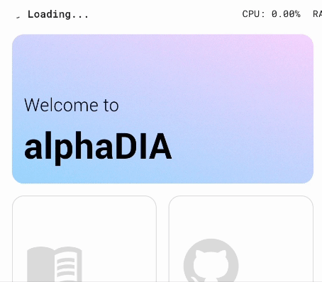

# Quickstart

The following guide will show how to search example Orbitrap Astral Data with alphaDIA.

## 1. Prerequisites
Make sure you have installed the GUI using the one-click installer. To verify your installation, open alphaDIA and make sure that the `BundledExecutionEngine` is selected.

## 2. Test data

For the first search we will be using a spectral library to search 60SPD bulk HeLa samples on the Orbitrap Astral. Download the test samples and save them: [HeLa library](https://datashare.biochem.mpg.de/s/Uw2yfNSbApfPpTk), [RAW files].(https://datashare.biochem.mpg.de/s/339jg5HtGrwLwDN)

## 3. Search settings

### Input Files
Import the library `.hdf` file and select the thre `.raw` files. You can select a human `.fasta` file for reannotation but it's generally not recommended for empirical spectral libraries.

### Method Settings
Although alphaDIA is highly customizable, we will only specify a limited number of settings here. Go to the *Search* settings and make the following changes:
* Number of candidates: 5
* MS1 Tolerance 4ppm
* MS2 Tolerance 7ppm

### Output files
Select an output folder where the search progress and the final results should be saved.

## 4. Run the search
Click *Run Workflow* to start the search and see the progress.
